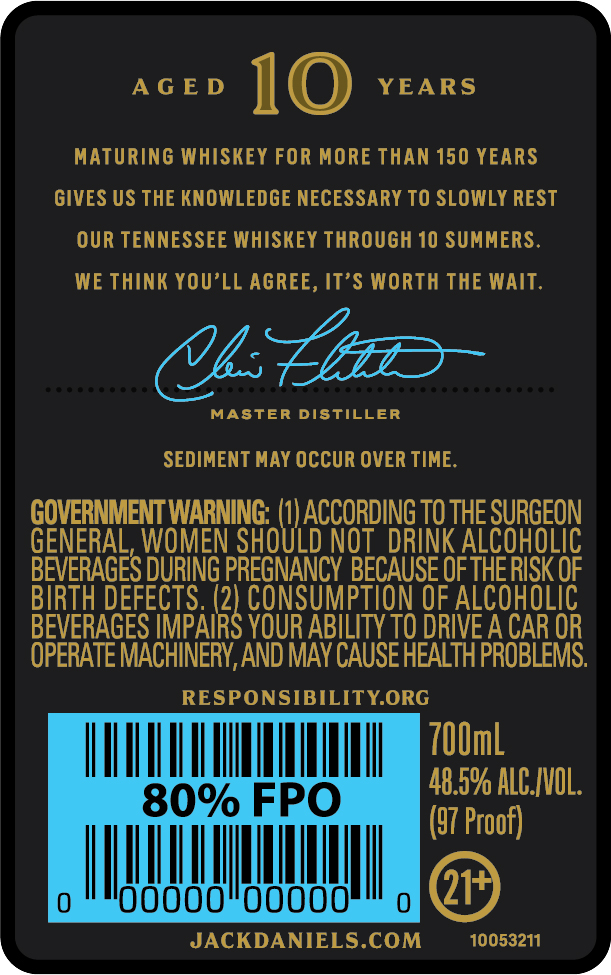
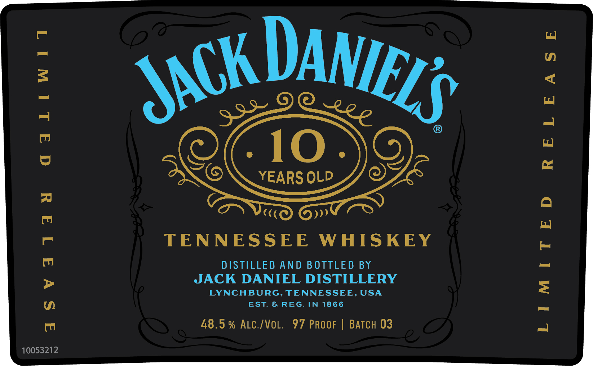

# TTB COLA Label Images - TTBID 23010001000241

**Brand Name:** JACK DANIEL'S

**Fanciful Name:** 10 YEARS OLD

**Issue Date:** 01/12/2023

**Origin Code:** 43

**Product Class/Type:** 140

**Source:** [TTB Public COLA Registry](https://ttbonline.gov/colasonline/viewColaDetails.do?action=publicFormDisplay&ttbid=23010001000241)

## Label Images

### Back Label

### Front Label

### Label 3

## Extracted Label Text

*Text extracted via OCR - may contain errors*

### Back Label

AGED 10 YEARS

MATURING WHISKEY FOR MORE THAN 150 YEARS

GIVES US THE KNOWLEDGE NECESSARY TO SLOWLY REST

OUR TENNESSEE WHISKEY THROUGH 10 SUMMERS.

WE THINK YOU’LL AGREE, IT’S WORTH THE WAIT.

bs hiio~

MASTER DISTILLER

SEDIMENT MAY OCCUR OVER TIME.

ae ater

TO THE SURGEON

GEN

L, WOMEN S

TAM

INK ALCOHOLI

BIRTH DEFECTS. (2

BEVERAGES DURING PRESNANCY BECAUSE OF THE RISK OF

2) CONSUMPTION OF ALCOHOLIC

BEVERAGES IMPAI

YOUR ABILITY TO DRIVE A CAR OR

OPERATE MACHINERY, AND MAY CAUSE HEALTH PROBLEMS.

RESPONSIBILITY.ORG

II Mn ll JIN

48.5% ALCVOL

(57 Proof)

gi

way

JACKDANIELS.COM

10053211

y

### Front Label

Ch

DAME

S$

-10.

ENC

YEARS OLD

OE

C(

»

TENNESSEE WHISKEY

DISTILLED AND BOTTLED BY

JACK DANIEL DISTILLERY

LYNCHBURG, TENNESSEE, USA

EST. & REG. IN 1866

48.5% ALC./VOL. 97 PRooF | BATCH 03

10053212

### Label 3

(0047377

LL
