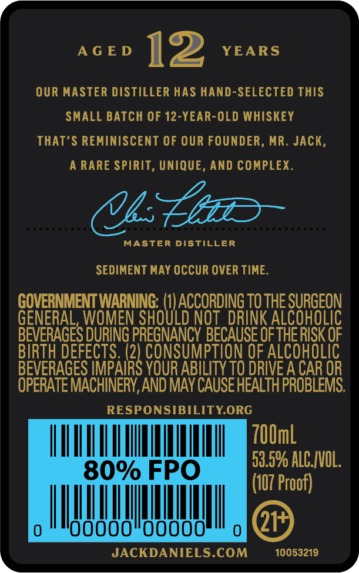
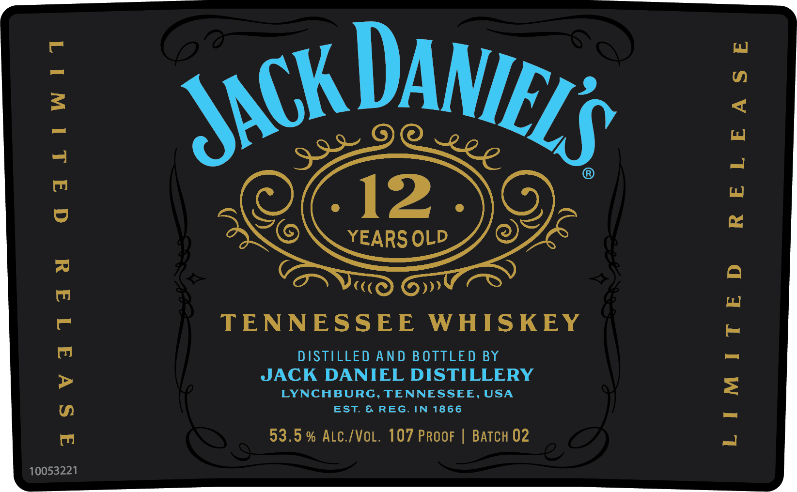

# TTB COLA Label Images - TTBID 23010001000270

**Brand Name:** JACK DANIEL'S

**Fanciful Name:** 12 YEARS OLD

**Issue Date:** 01/12/2023

**Origin Code:** 43

**Product Class/Type:** 140

**Source:** [TTB Public COLA Registry](https://ttbonline.gov/colasonline/viewColaDetails.do?action=publicFormDisplay&ttbid=23010001000270)

## Label Images

### Back Label

### Front Label

### Label 3

## Extracted Label Text

*Text extracted via OCR - may contain errors*

*1 image(s) excluded: text did not meet readability threshold*

### Back Label

AGED 12 YEARS

OUR MASTER DISTILLER HAS HAND-SELECTED THIS

SMALL BATCH OF 12-YEAR-OLD WHISKEY

THAT’S REMINISCENT OF OUR FOUNDER, MR. JACK

A RARE SPIRIT, UNIQUE, AND COMPLEX

(Ui Cie

MASTER DISTILLER

SEDIMENT MAY OCCUR OVER TIME.

ae ater

TO THE SURGEON

GEN

L, WOMEN S

TAM

INK ALCOHOLI

BIRTH DEFECTS. (2

BEVERAGES DURING PRESNANCY BECAUSE OF THE RISK OF

2) CONSUMPTION OF ALCOHOLIC

BEVERAGES IMPAI

YOUR ABILITY TO DRIVE A CAR OR

OPERATE MACHINERY, AND MAY CAUSE HEALTH PROBLEMS.

RESPONSIBILITY.ORG

II Mn ll JIN

(107 Proof)

59.0% ALC.IVOL

gi

way

JACKDANIELS.COM

10053219

y

### Front Label

qaLtiwtidt
RELEASE

TENNESSEE WHISKEY

DISTILLED AND BOTTLED BY
JACK DANIEL DISTILLERY
LYNCHBURG, TENNESSEE, USA
EST. & REG. IN 1866

53.5% ALc./VoL. 107 PRoor | BAaTcH 02

aSvatad
LIMITED

10053221
