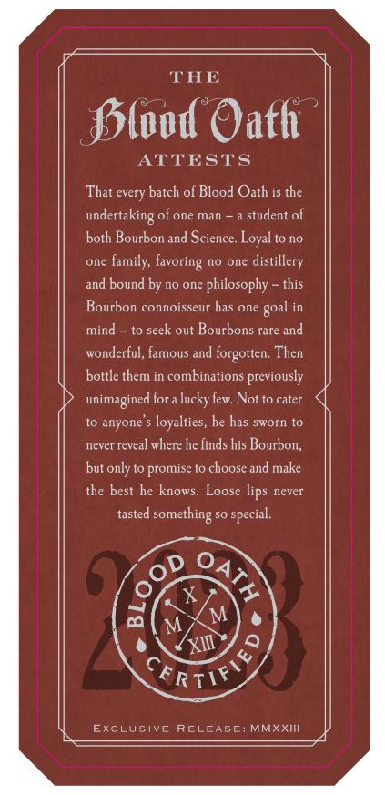
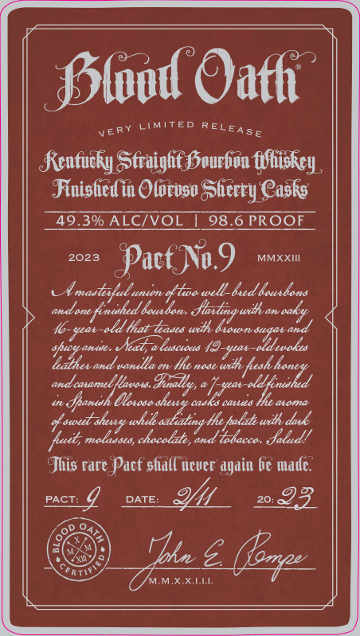
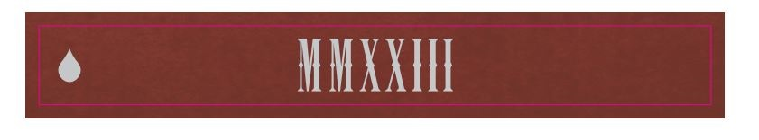
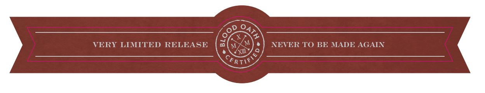

# TTB COLA Label Images - TTBID 23013001000162

**Brand Name:** BLOOD OATH

**Fanciful Name:** PACT NO. 9

**Issue Date:** 02/03/2023

**Origin Code:** 29

**Product Class/Type:** 641

**Source:** [TTB Public COLA Registry](https://ttbonline.gov/colasonline/viewColaDetails.do?action=publicFormDisplay&ttbid=23013001000162)

## Label Images

### Back Label

### Front Label

### Label 3

### Label 4

## Extracted Label Text

*Text extracted via OCR - may contain errors*

*1 image(s) excluded: text did not meet readability threshold*

### Back Label

THE
Jslood Oath
ATTESTS
That every batch of Blood Oath is the
undertaking of one man
student of
both Bourbon and Science. Loyal to no
onc
family, favoring no one distillery
and bound by no one
philosophy
this
Bourbon connoisseur has one
goal in
mind
to seek out Bourbons rare and
wonderful, famous and
forgotten: Then
bottle them in combinations previously
unimagined for a lucky lew Not to cater
to anyone
loyalties, he has sworn to
never reveal where he finds his Bourbon,
but only to promise to choose and make
the best he knows
Loose lips never
tasted
something
special.
X
M
M
'XIII
%
ExclusivE RELEASE
MMXXI
36
1
CFR"
TIF

### Front Label

J5lod Oath
VERY LIMITED
Kcnfucky Sfraight Sourbon fShiskcy_
Finishcd in Olorvso Sherty Casks
49.30 ALCIVOL
98 6PROQF
2023
Pact Nu.9
MMXXII
Umastofutunen dtwa well_bed kouxdons
andane
"fenuhed tout
fxtaguxth
a
oaky
I6-seat-ald hat-Easeo wxlh diowt sugatand
xead, a
snat
Ildeeakes
"ahewana
and uanla
Hhe
naje
wrlh
andcatamel [avatss
9azhy e ]rspat
E
Jpavah
csks canio
#swedt shenyy wshule
Ihe pulah url daxk
"uuit,; molaases, chocolato,
'Todaccas Jaled!
Jhis rare Pact shall ncver again be madc.
PACT:
4
DATE:
20:
93
Iu5
MXXA
RELEASE
'ltscucs
/esd ,
Yd haaoy
and
(ep

### Label 4

VERY LMITED RELEASE
NEVER TO BE MADE AGAIN
fRTIf
