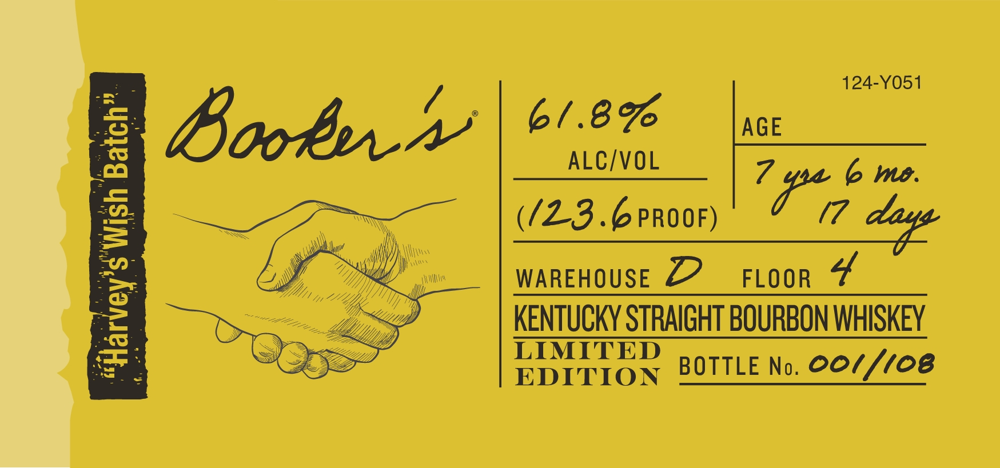
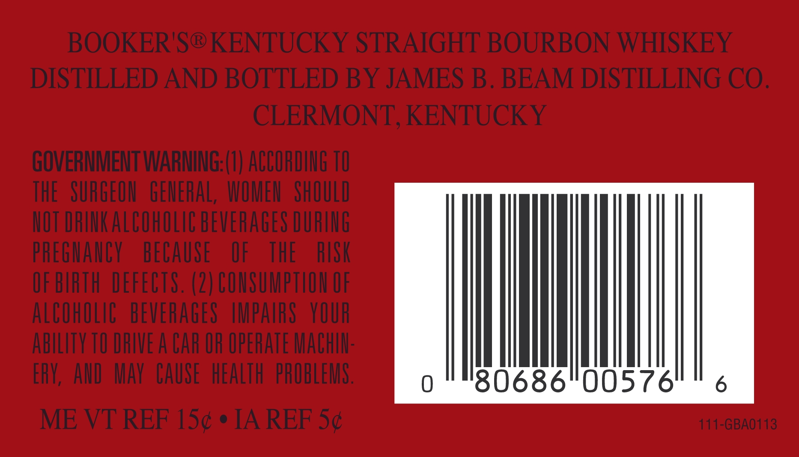

# TTB COLA Label Images - TTBID 23017001000089

**Brand Name:** BOOKER'S

**Issue Date:** 01/19/2023

**Origin Code:** 22

**Product Class/Type:** 101

**Source:** [TTB Public COLA Registry](https://ttbonline.gov/colasonline/viewColaDetails.do?action=publicFormDisplay&ttbid=23017001000089)

## Label Images

### Label 1

### Label 2

### Label 3

### Label 4

## Extracted Label Text

*Text extracted via OCR - may contain errors*

*1 image(s) excluded: text did not meet readability threshold*

### Label 1

Boob

De Whiithyy ste thes plochege 0

—_

polighes

one Hire offlim Learn ifr

pica

Sotihd wipers (rds un f Line

Gy gmt, in Lean bh heis

Mtiihiy from Ai 70 Ligh Geen

=<

aE Sse

### Label 2

124-Y051

6/.8%

AGE

Boob +

—_ ALC/VOL

6 me

UL.

(/Z23 .6 PROOF)

WAREHOUSE 22

FLOOR 4

KENTUCKY STRAIGHT BOURBON WHISKEY

LIMITED

EDITION

BOTTLE No. 0O///08

### Label 3

BOOKER'S® KENTUCKY STRAIGHT BOURBON WHISKEY

DISTILLED AND BOTTLED BY JAMES B. BEAM DISTILLING CO.

CLERMONT, KENTUCKY

GOVERNMENT WARNING: (1) ACCORDING 10

THE SURGEON GENERAL, WOMEN SHOULD

NOT DRINK ALCOHOLIC BEVERAGES DURING

PREGNANCY BECAUSE OF THE ISK

OF BIRTH DEFECTS. (2) CONSUMPTION OF

ALCOWOLIC BEVERAGES IMPAIRS YOUR

ABILITY TO DRIVE A CAR OR OPERATE MACHIN

ERY, AND MAY CAUSE HEALTH PROBLEMS

111-GBA0113

ME VT REF 15¢ ¢ IA REF 5¢
