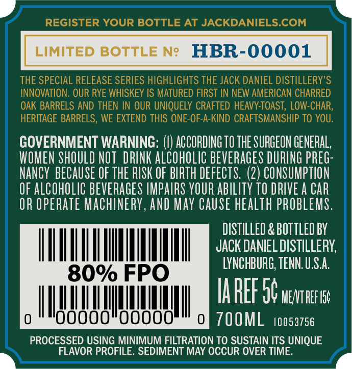
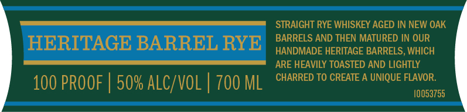
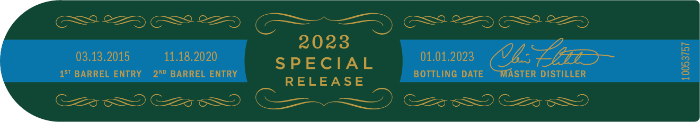

# TTB COLA Label Images - TTBID 23051001000312

**Brand Name:** JACK DANIEL'S

**Fanciful Name:** TWICE BARRELED SPECIAL RELEASE

**Issue Date:** 03/02/2023

**Origin Code:** 43

**Product Class/Type:** 142

**Source:** [TTB Public COLA Registry](https://ttbonline.gov/colasonline/viewColaDetails.do?action=publicFormDisplay&ttbid=23051001000312)

## Label Images

### Back Label

### Front Label

### Label 4

## Extracted Label Text

*Text extracted via OCR - may contain errors*

### Back Label

GOVERNMENT WARNING: (|) ACCORDING TO THE SURGEON GENERAL

WOMEN SHOULD NOT DRINK ALCOHOLIC BEVERAGES DURING PREG:

NANCY BECAUSE OF THE RISK OF BIRTH DEFECTS. (2) CONSUMPTION

OF ALCOHOLIC BEVERAGES IMPAIRS YOUR ABILITY 10 DRIVE A CAR

OR OPERATE MACHINERY, AND MAY CAUSE HEALTH PROBLEMS

DISTILLED & BOTTLED BY

OE

JACK DANIEL DISTILLERY,

LYNCHBURG, TENN. U.S.A

lA ALF ab MEATREF 1

IM! Ul i i tty

TOOML toosa756

PROCESSED USING MINIMUM FILTRATION TO SUSTAIN ITS UNIQUE

FLAVOR PROFILE. SEDIMENT MAY OCCUR OVER TIME.

### Front Label

STRAIGHT RYE WHISKEY AGED IN NEW OAK

BARRELS AND THEN MATURED IN OUR

HERITAGE BARREL RYE

HANDMADE HERITAGE BARRELS, WHICH

ARE HEAVILY TOASTED AND LIGHTLY

CHARRED TO CREATE A UNIQUE FLAVOR.

100 PROOF | 50% ALC/VOL | 700 ML

10053755

### Label 4

GSS 82 GS8 &2 (DD) GP 2 GS SD

2023

03.13.2015

11.18.2020

01.01.2023

SPECIAL

S'BARREL ENTRY 2%? BARREL ENTRY

RELEASE

BOTTLING DATE

g

STER DISTILLER

C28 S25 cS) ——) Cz 5
