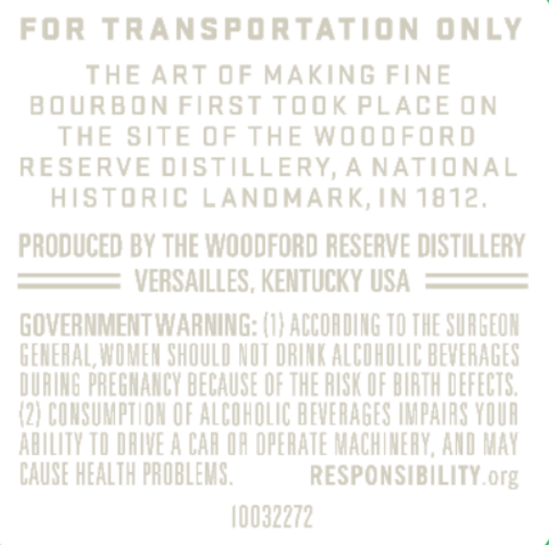
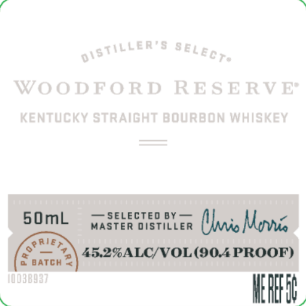

# TTB COLA Label Images - TTBID 23051001000320

**Brand Name:** WOODFORD RESERVE

**Issue Date:** 02/23/2023

**Origin Code:** 22

**Product Class/Type:** 101

**Source:** [TTB Public COLA Registry](https://ttbonline.gov/colasonline/viewColaDetails.do?action=publicFormDisplay&ttbid=23051001000320)

## Label Images

### Back Label

### Label 1

## Extracted Label Text

*Text extracted via OCR - may contain errors*

### Back Label

FOR TRANSPORTATION
OnLy
THE ArT 0F MaKNG FINE
b ourboN First took PLACE N
THE SITE 0f THE Woodford
RESERVE distillery A NATIONAL
hisToric LaNDMARK,IN 1812,
PRODUCED BV THE Woodford RESERVE DISTILLERV
VERSAILLES , KENTUCKV USA
GOVERNMENT WARNING: (I} ACCOADING TO THE SURGEOH
GEMEHAL; WVOMEM SHOULD MOT DRUMK ALCOHOLAC BEVERAGES
@URUMG PREGMAMCY BECAUSE OF THE RUS OF BURTH DEFECTS;
(2| CUNSUMPTLOH OF ALCuhOlIg BEVERAGES HMPAURS YOUR
abLUTY TI DRIVE A CAH UF OPERATE MACHINEHY, AND May
CAUSE HEALTH PROBLEMS,
RESPONSIBILATY org
40032272.

### Label 1

WOODFO RD
R E S E RV E
KEnTUcKY STRAiGHT BOURBON WhiskEy
5OmL
P=
Selected BY
MASTER DISTILLER
(li Momnis
14
25.27ALC/VOL(90ZPROOF)
BATCH
10038937
HEHEFD
0isTilLER '$
SELect"
'0 PR/e,
