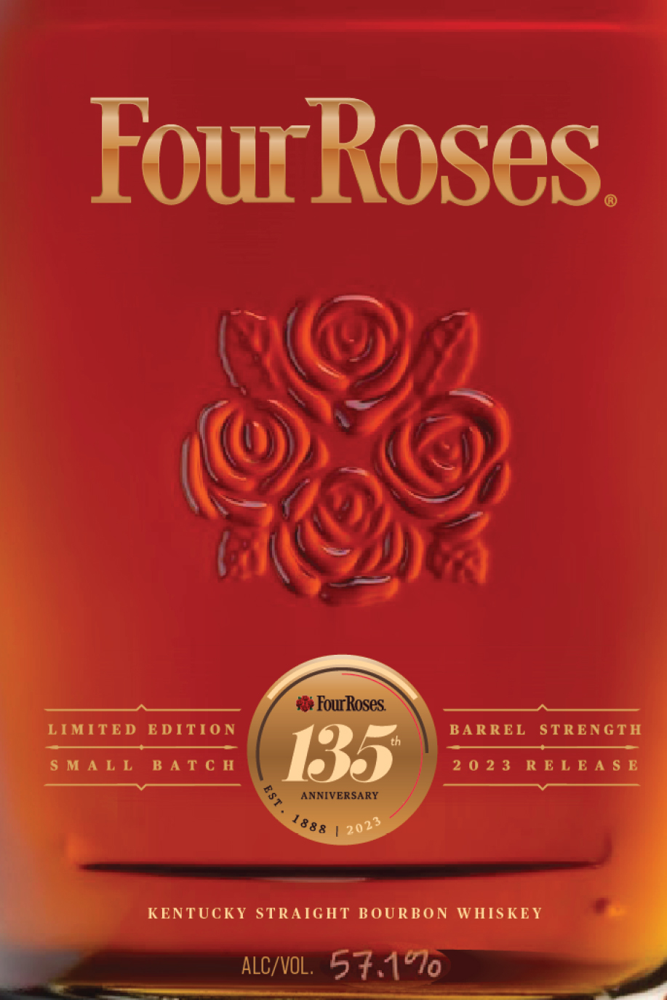
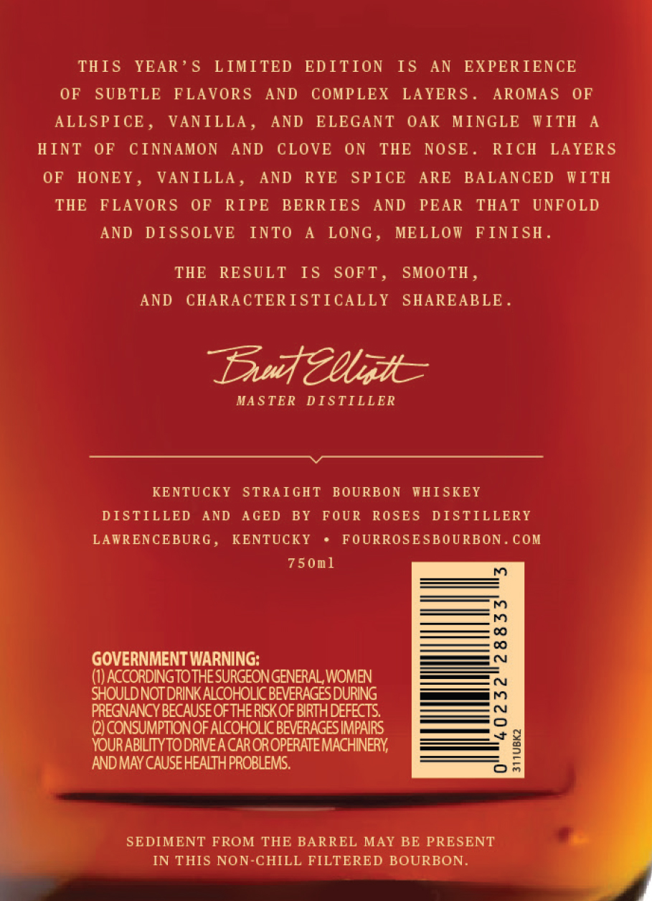

# TTB COLA Label Images - TTBID 23051001000526

**Brand Name:** FOUR ROSES

**Fanciful Name:** LIMITED EDITION SMALL BATCH

**Issue Date:** 02/27/2023

**Origin Code:** 22

**Product Class/Type:** 101

**Source:** [TTB Public COLA Registry](https://ttbonline.gov/colasonline/viewColaDetails.do?action=publicFormDisplay&ttbid=23051001000526)

## Label Images

### Label 1

### Label 2

### Label 3

## Extracted Label Text

*Text extracted via OCR - may contain errors*

### Label 1

FourRoses

YC

}

ee

4

fos

SS)

, tc SD) A

LIMITED EDITION

SMALL BATCH

BARREL STRENGTH

2023 RELEASE

KENTUCKY STRAIGHT BOURBON WHISKEY

### Label 2

THIS YEAR’S LIMITED EDITION IS AN EXPERIENCE

OF SUBTLE FLAVORS AND COMPLEX LAYERS

AROMAS OF

ALLSPICE, VANILLA

AND ELEGANT OAK MINGLE WITH A

HINT OF CINNAMON AND CLOVE ON THE NOSE

RICH LAYERS

OF HONEY

VANILLA

AND RYE SPICE ARE BALANCED WITH

THE FLAVORS OF RIPE BERRIES AND PEAR THAT UNFOLD

AND DISSOLVE INTO A LONG, MELLOW FINISH

THE RESULT IS SOFT

SMOOTH

AND CHARACTERISTICALLY SHAREABLE.

Dau Magh=

MASTER DISTILLER

Ge

KENTUCKY STRAIGHT BOURBON WHISKEY

DISTILLED AND AGED BY FOUR ROSES DISTILLERY

LAWRENCEBURG

KENTUCKY + FOURROSESBOURBON. COM

750m1

GOVERNMENT WARNING:

(1) ACCORDING TO THE SURGEON GENERAL WOMEN

SHOULD NOT DRINK ALCOHOLIC BEVERAGES DURING

ia)

EGNANCY BECAUSE OFTHE RISK OF Ene

| CONSUMPTION OF ALCOHOLIC BEVERAGES

9

YOURABLITYTODRWEACAR OROPERATE MACHINERY

AND MAY CAUSE HEALTH PROBLEMS.

On

4

SEDIMENT FROM THE BARREL MAY BE PRE

J ih

IN THIS NON-CHILL FILTERED BOURBON

### Label 3

—-_

rN

@& fo

I

5

a

?

ANNIVERSARY

"889

5

CC —tttisr

202
