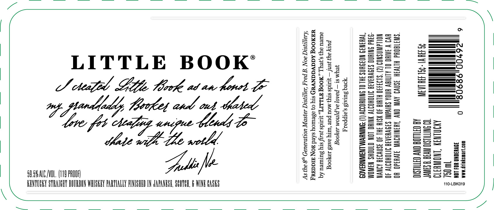

# TTB COLA Label Images - TTBID 23060001000800

**Brand Name:** LITTLE BOOK

**Fanciful Name:** FREDDIE NOE

**Issue Date:** 03/06/2023

**Origin Code:** 22

**Product Class/Type:** 641

**Source:** [TTB Public COLA Registry](https://ttbonline.gov/colasonline/viewColaDetails.do?action=publicFormDisplay&ttbid=23060001000800)

## Label Images

### Label 1

### Label 2

## Extracted Label Text

*Text extracted via OCR - may contain errors*

*1 image(s) excluded: text did not meet readability threshold*

### Label 1

>

LITTLE BOOK’
Japa net
¢ Mtoflet atl out
Mate wih Le wotld.

Sods fle
SOSHALC/VOL. (119 PROOF)

_ STRAIGHT BOURBON WHISKEY PARTIALLY FINISHED IN JAPANESE, SCOTCH, & WINE GASKS

As the 8" Generation Master Distiller, Fred B. Noe Distillery,
FREDDIE NOE pays homage to his GRANDDADDY BOOKER
by naming his first spirit “LITTLE BOOK.” That’s the name
Booker gave him, and now this spirit — just the kind
Booker would’ve loved — is what
Freddie’s giving back.

9

soso

00492

ET AEFI

80686

0

T, KENTUCKY

GOVERNMENT WARNING: (

WOMEN SHOULD NOT
ISTILLED AND BOTTLED BY
JAMES B. BEAM DISTILLING C0.

110-LBKO19
