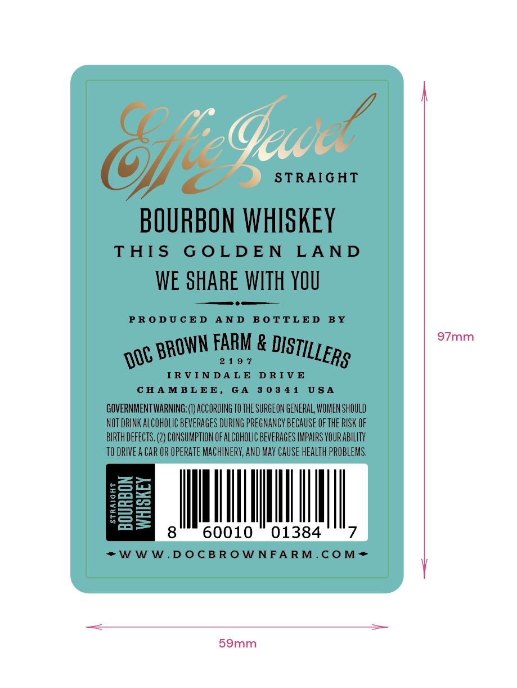
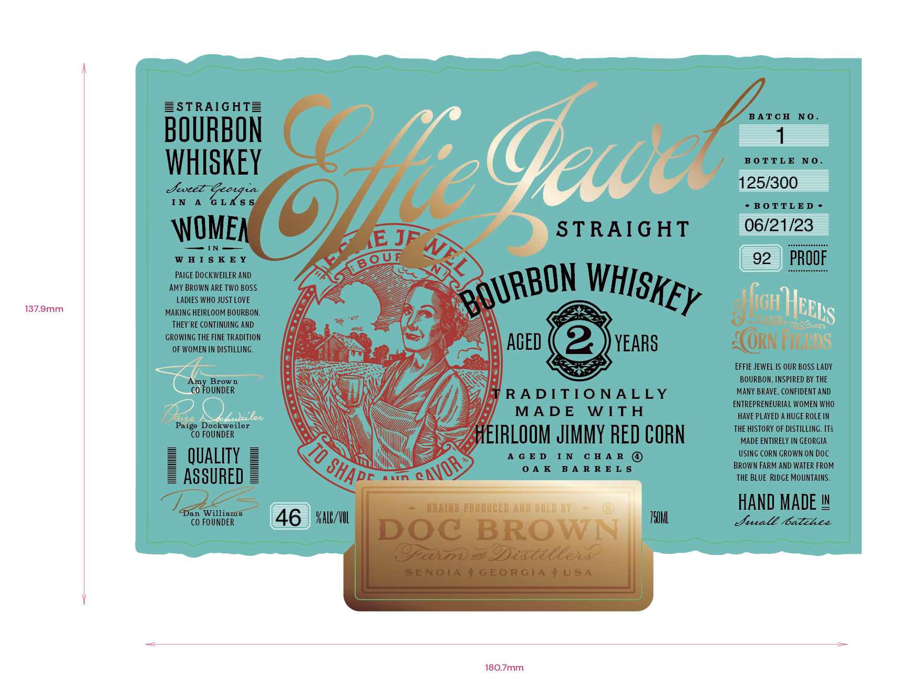
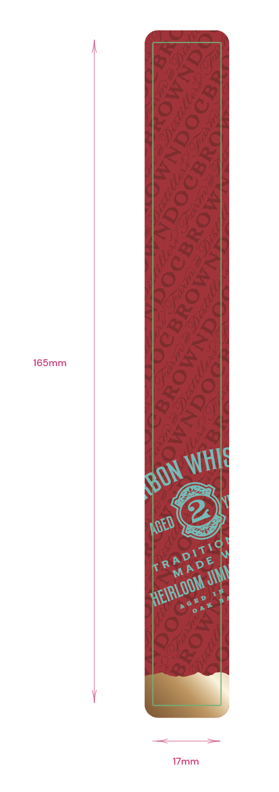

# TTB COLA Label Images - TTBID 23105001000133

**Brand Name:** EFFIE JEWEL

**Issue Date:** 04/20/2023

**Origin Code:** 08

**Product Class/Type:** 101

**Source:** [TTB Public COLA Registry](https://ttbonline.gov/colasonline/viewColaDetails.do?action=publicFormDisplay&ttbid=23105001000133)

## Label Images

### Back Label

### Front Label

### Label 3

## Extracted Label Text

*Text extracted via OCR - may contain errors*

*1 image(s) excluded: text did not meet readability threshold*

### Back Label

»

/

7

IGHT

Oe “ws

BOURBON WHISKEY

THIS GOLDEN LAND

WE SHARE WITH YOU

——

PRODUCED AND BOTTLED BY

97mm

1 OR Ne OISTIL ERs

IRVINDALE DRIVE

CHAMBLEE, GA 80841 USA

GOVERNMENT WARNING: (1) ACCORDING TO THE SURGEON GENERAL WOMEN SHOULD

NOT DRINK ALCOHOLIC BEVERAGES DURING PREGNANCY BECAUSE OF THE RISK OF

BIRTH DEFECTS. (2) CONSUMPTION OF ALCOHOLIC BEVERAGES IMPAIRS YOUR ABILITY

TODRIVEA CAR OR OPERATE MACHINERY, AND MAY CAUSE HEALTH PROBLEMS,

row

Pi-=1

--)

S =

II

so

II

60010 01384

7

*>WWW.DOCBROWNFARM.COM*+

59mm

### Front Label

SSTRAIGHT=

BATCH NO.

BOURBON

1

L_

BOTTLE NO.

WHISKEY

Seveer

125/300

IN A GLAS

+BOTTLED>

WOME,

HS

STRAIGHT

— IN

“ZS

06/21 cs

WHISKEY

KY KO OUR

AMY BROWN ARE TWO BOSS.

PAIGE DOCKWEILER AND

2

LADIES WHO JUST LOVE

ON WHisy

137.9mm

MAKING HEIRLOOM BOURBON.

Fo

Be

ly

NT

THEY'RE CONTINUING AND

re

GROWING THE FINE TRADITION

OF WOMEN IN DISTILLING.

SN

AGED

YEARS

ORN ii

NT

Te

EFFIE JEWEL IS OUR BOSS LADY

CO ToU

INDER

row n.

MANY BRAVE, CONFIDENT AND

BOURBON, INSPIRED BY THE

\N

\

Ce)

yi

RADITIONALLY

ENTREPRENEURIAL WOMEN WHO.

Zi

MADE WITH

HAVE PLAYED A HUGE ROLE IN

Paige Dockweiler

CO FOUNDER

\\

S

IRLOOM JIMMY RED CORN

THE HISTORY OF DISTILLING. ITS

MADE ENTIRELY IN GEORGIA

\

ii

USING CORN GROWN ON DOC

QUALITY

oy

mn}

i My

<

AGED IN CHAR ©

OAK BARRELS

BROWN FARM AND WATER FROM

ASSURED

IX

Wy

THE BLUE RIDGE MOUNTAINS.

jan Willi:

OLD

i

HAND MADE '

CO FOUNDER

46 | sill

TOML

Dural Catches

180.7mm.
