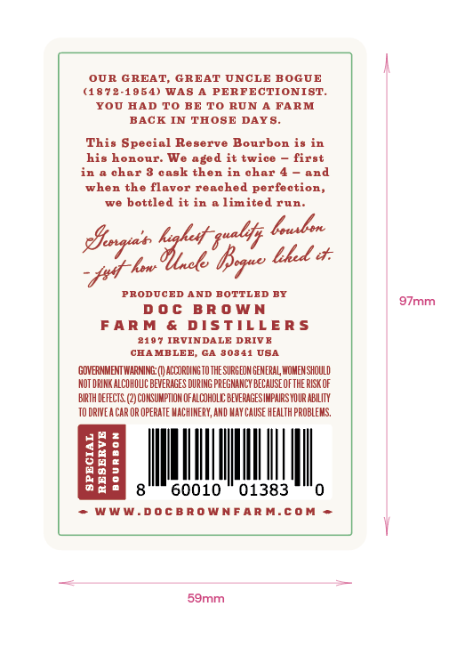
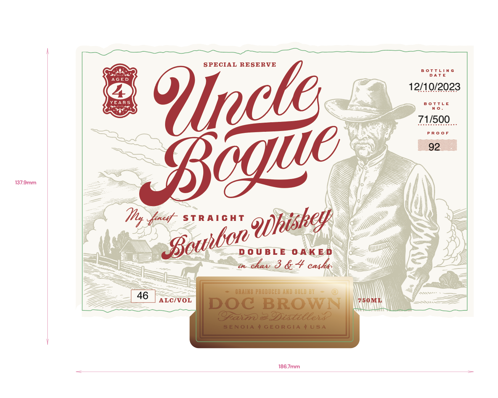
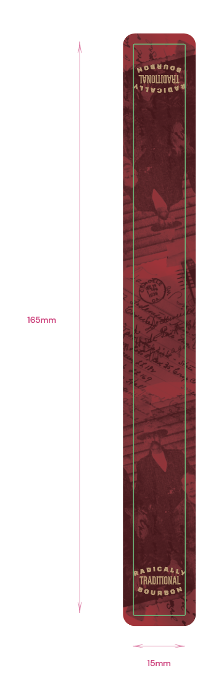

# TTB COLA Label Images - TTBID 23105001000135

**Brand Name:** UNCLE BOGUE

**Issue Date:** 04/20/2023

**Origin Code:** 08

**Product Class/Type:** 101

**Source:** [TTB Public COLA Registry](https://ttbonline.gov/colasonline/viewColaDetails.do?action=publicFormDisplay&ttbid=23105001000135)

## Label Images

### Back Label

### Front Label

### Label 3

## Extracted Label Text

*Text extracted via OCR - may contain errors*

*1 image(s) excluded: text did not meet readability threshold*

### Back Label

OUR GREAT, GREAT UNCLE BOGUE

(4872-1954) WAS A PERFECTIONIST.

YOU HAD TO BE TO RUN A FARM

BACK IN THOSE Days.

This Special Re

eve Bourbon is in

his honour. We aged it twice — first

in a char 8 cas

then in char 4 — and

when the fli

yr reached perfection,

we bottled it in a limited run.

aly Lousbor

bhed

hee

jet bow

PRODUCED AND BOTTLED BY

97mm

DOc BROWN

FARM & DISTILLERS

2107 IRVINDALE DRIVE

CHAMBLEE, cA 30341 USA

GOVERNMENT WARNINE:()ACOROINGTOTHESURGED ENCEAL WOMER SHOULD

NOT ORNKALCONOUC BEVERAGES DURING PREGHANCY BECAUSE OFTHE RISK OF

RTH OEFECTS. (2) CONSUMPTION FALCOHOLE BVERAGES MARS YOUR ABLITY

TOORIVEACAROR OPERATE MACHINERY, AND HAY CAUSE HEALTH PROBLEMS.

<b

48

Se

Sa

Pr

aa

|

|

Bat

8

60010 © 01383

0

+ WWW.DOCBROWNFARM.COM =

i

-

<

-

59mm

### Front Label

SPECIAL
~a
b%ff!n6
g
12/1.0/2023
YEARS
TtLE
N 0
71/500
Y8v@c
92
R 0 0
137.9mm
Hht snet
STRAIGAT
D 0 U BL E
0 AKE D
ekav 8 & 4 ca4ks
CRAIKS PRODUCED AND 80LV D 4
46
ALCIVOL
750ML
DoC BROWN
@asz
(lf
Oixti@ees
SENOTA
GEO RGIA
USA
186.7mm
Qdhishey
 ouhbon
