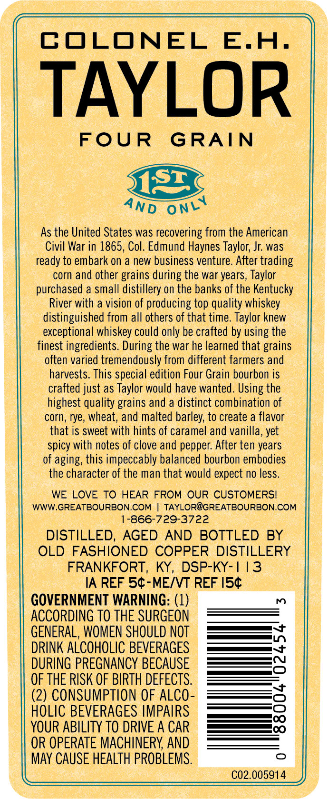
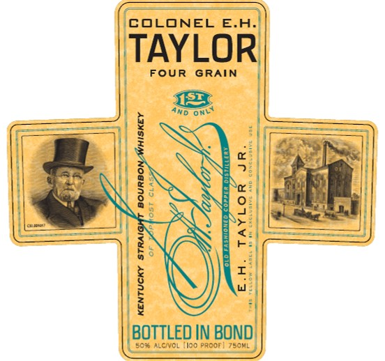
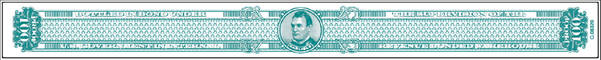

# TTB COLA Label Images - TTBID 23109001000786

**Brand Name:** COLONEL E.H. TAYLOR

**Issue Date:** 05/15/2023

**Origin Code:** 22

**Product Class/Type:** 119

**Source:** [TTB Public COLA Registry](https://ttbonline.gov/colasonline/viewColaDetails.do?action=publicFormDisplay&ttbid=23109001000786)

## Label Images

### Back Label

### Label 1

### Label 2

## Extracted Label Text

*Text extracted via OCR - may contain errors*

*1 image(s) excluded: text did not meet readability threshold*

### Back Label

COLONEL
E.H.
TAYLOR
FOUR
GRAIN
As the United States was recovering from the American
Civil War in 1865, Col. Edmund Haynes Taylor; Jr: was
ready to embark on
a new
business venture. After trading
corn and other grains during the war years, Taylor
purchased a small distillery on the banks of the Kentucky
River with a vision of producing top quality whiskey
distinguished from all others of that time. Taylor knew
exceptional whiskey could only be crafted by using the
finest ingredients During the war he learned that grains
often varied tremendously from different farmers and
harvests. This special edition Four Grain bourbon is
crafted just as Taylor would have wanted. Using the
highest quality grains and a distinct combination of
corn, rye, wheat; and malted barley; to create a flavor
that is sweet with hints of caramel and vanilla, yet
spicy with notes of clove and pepper: After ten years
of aging, this impeccably balanced bourbon embodies
the character of the man that would expect no less.
WE LOVE TO HEAR FROM OUR CUSTOMERSI
WWW.GREATBOURBON.COM
TAYLOR@GREATBOURBON.COM
1-866-729-3722
DISTILLED,
AGED
AND BOTTLED
BY
OLD
FASHIONED COPPER DISTILLERY
FRANKFORT,
KY ,
DSP-KY-|13
IA REF 54-MEIVT REF I54
GOVERNMENT WARNING: (1)
m
ACCORDING TO THE SURGEON
GENERAL, WOMEN SHOULD NOT
DRINK ALCOHOLIC BEVERAGES
8
DURING PREGNANCY BECAUSE
OF THE RISK OF BIRTH DEFECTS
(2) CONSUMPTION OF ALCO
3
HOLIC BEVERAGES IMPAIRS
YOUR ABILITY TO DRIVE A CAR
OR OPERATE MACHINERY AND
MAy CAUSE HEALTH PROBLEMS.
C02.005914
5121
ONLY
AND

### Label 1

COLONEL E.A
TAYLOR
FOUR
GRAIN
43
'Rd
Onl
1
1
S
0
1
1
1
1
BOTTLED IN BOND
BC7? ALCNOL iioo Proor[
TSCmL
5
