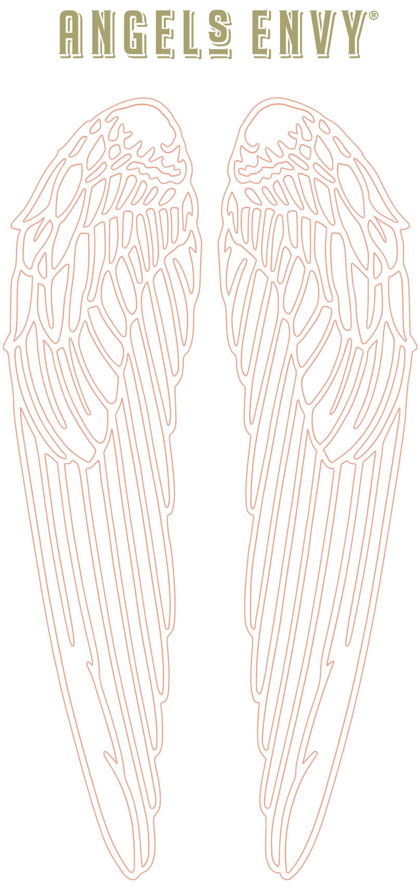
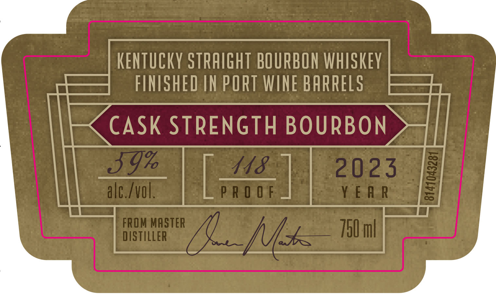
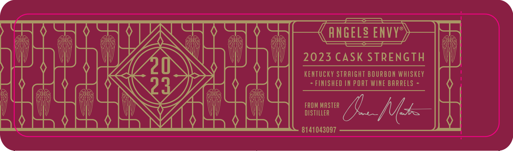
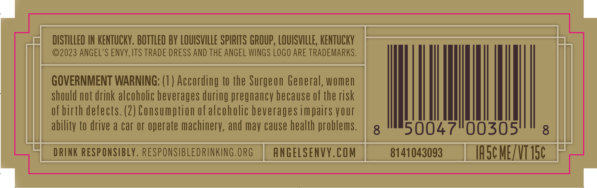
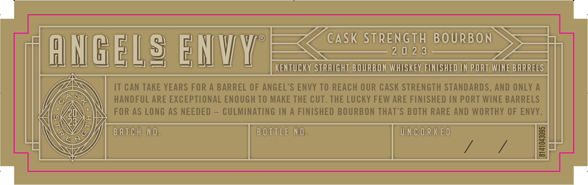

# TTB COLA Label Images - TTBID 23132001000515

**Brand Name:** ANGEL'S ENVY

**Fanciful Name:** CASK STRENGTH

**Issue Date:** 06/12/2023

**Origin Code:** 22

**Product Class/Type:** 641

**Source:** [TTB Public COLA Registry](https://ttbonline.gov/colasonline/viewColaDetails.do?action=publicFormDisplay&ttbid=23132001000515)

## Label Images

### Label 1

### Label 2

### Label 3

### Label 4

### Label 5

### Label 6

## Extracted Label Text

*Text extracted via OCR - may contain errors*

*2 image(s) excluded: text did not meet readability threshold*

**Detected Proof:** 118

### Label 2

KENTUCKY STRAIGHT BOURBON WHISKEY
FINISHED IN PORT WINE BARRELS
CASK STRENGTH BOURBON
59%
148
2023
1
alc_Ivol
P R 0 0 F
Y E A R
FROM MASTER
750ml
DISTILLER
hk

### Label 3

ANGELS ENVY
2023 CASK STRENGTH
kentucky STRAIGHT BOURBON whISKeY
23_
FINISHED IN PORT WINE BARRELS
FROM MASTER
DISTILLER
h
8141043097

### Label 4

DISTILLED IN KENTUCKY . BOTTLED BY LOUISVILLE SPIRITS GROUP , LOUISVILLE; KENTUCKY
2023 ANGEL'S ENVY,ITS TRADE DRESS AND THE ANGEL WINGS LOGo ARE TRADEMARKS .
GOVERNMENT WARNING: (1 ) According to the Surgeon General, women
should not drink alcoholic beverages during pregnancy because of the risk
of birth defects. (2) Consumption ofalcoholic beverages impairs your
ability to drive a car or operate machinery, and may Cause health problems.
8
50047100305'
8
DRINK RESPONSIBLY, RESPONSIBLEDRINKING.ORG
ANGELSENVY.COM
8141043093
IA5C ME /VT 15C

### Label 6

CASK STrENGTH
BOURBON
AngeLg EMVY
2 0 2 3
KENTUCKY StRAIGHT BOURBON WHSKEY FINISHED IN PORT WINE BARRELS
IT CAN TAKE YEARS FOR A BARREL OF ANGEL'S ENVY TO REACH OUR CASK STRENGTH STANDARDS, AND ONLY A
A$
0
6
HANDFUL ARE EXCEPTIONAL ENOUGH TO MAKE THE CUT. THE LUcKY FEW ARE FINISHED IN PORT WINE BARRELS
FOR AS LONG AS NEEDED
CULMINATING IN
A FINISHED BOURBON THAT'S BOTH RARE AND WORTHY OF ENVY_
6
B A T C H
N O,
B 0 TTLE NO,
U N € 0 R K E D
N
1
F
