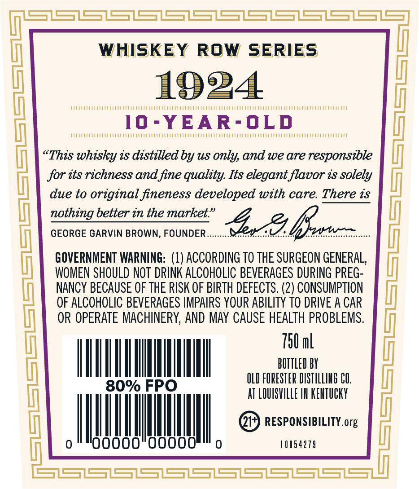
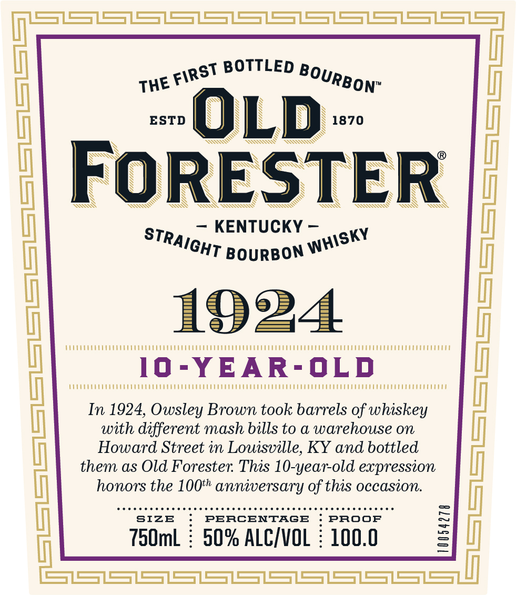
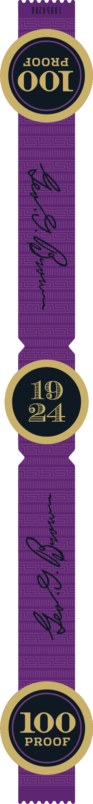

# TTB COLA Label Images - TTBID 23144001000517

**Brand Name:** OLD FORESTER

**Fanciful Name:** 1924

**Issue Date:** 05/25/2023

**Origin Code:** 22

**Product Class/Type:** 101

**Source:** [TTB Public COLA Registry](https://ttbonline.gov/colasonline/viewColaDetails.do?action=publicFormDisplay&ttbid=23144001000517)

## Label Images

### Back Label

### Front Label

### Label 3

## Extracted Label Text

*Text extracted via OCR - may contain errors*

### Back Label

WHISKEY ROW SERIES

1924

10- -YEAR- OLD

“This whisky ts distilled by us only, and we are responsible

for tts richness and fine quality. Its elegant flavor ts solely

due to original fineness developed with care. There ts

nothing better in the market.”

GEORGE GARVIN BROWN, FOUNDER

GOVERNMENT WARNING: (1) ACCORDING TO THE SURGEON GENERAL

WOMEN SHOULD NOT DRINK ALCOHOLIC BEVERAGES DURING PREG-

NANCY BECAUSE OF THE RISK OF BIRTH DEFECTS. (2) CONSUMPTION

OF ALCOHOLIC BEVERAGES IMPAIRS YOUR ABILITY TO DRIVE A CAR

OR OPERATE MACHINERY, AND MAY CAUSE HEALTH PROBLEMS

70 ml

ILA

BOTTLED BY

OLD FORESTER DISTILLING CO

AT LOUISVILLE IN KENTUCKY

@ RESPONSIBILITY. org

ll

ill

00000

|

10054279

00000

### Front Label

aHe inst BOTTLED Bg, rip

ESTD

1870

SN

SW AON

SSN

SN

SS

NA

SSS

N

aN

m=

NN

S

v

SS

\

GZ

2S

IN

oN

SS WN

SSX

— KENTUCKY —

SKY

‘CHT BourBON WY

1924

Me

10-YEAR-OLD

MO

In 1924, Owsley Brown took barrels of whiskey

with different mash bills to a warehouse on

Howard Street in Louisville, KY and bottled

them as Old Forester. This 10-year-old expression

honors the 100” anniversary of this occasion.

eee ceeeseneeces

SIZE

ERCENTAG

ste eee eeeececeeecevcscecerererees

ROOF

750mL : 50% ALC/VOL : 100.0
