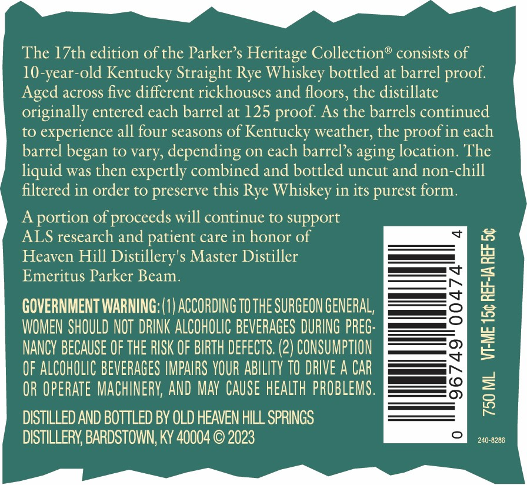
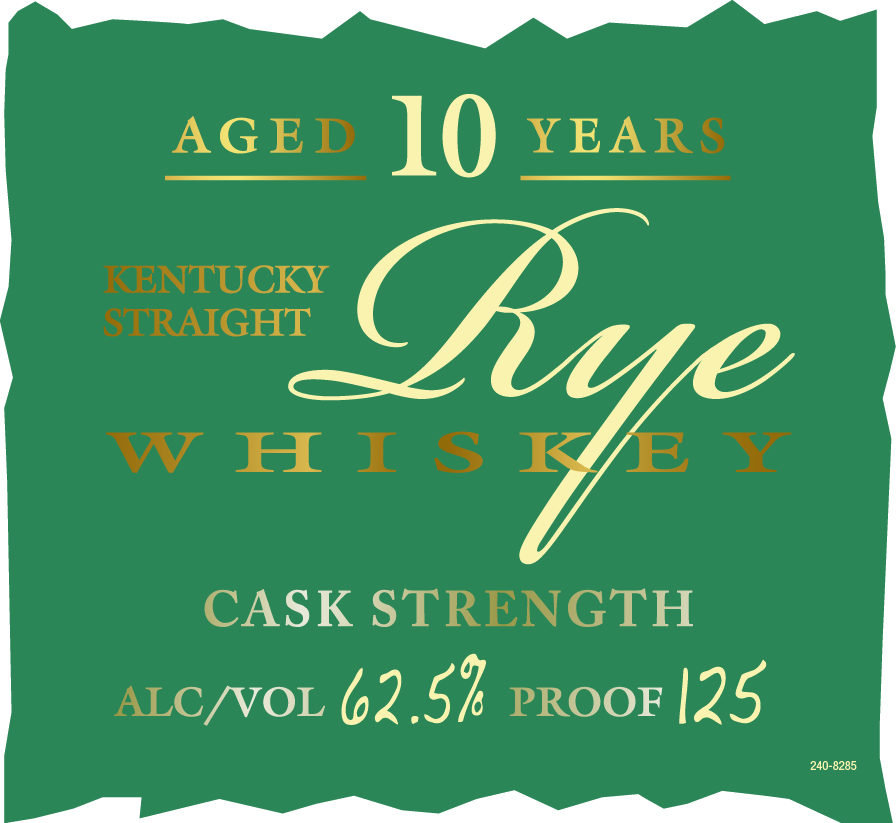
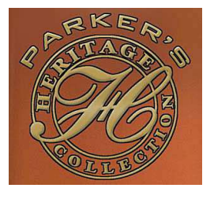
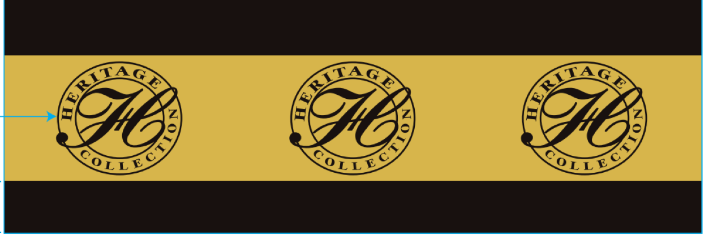
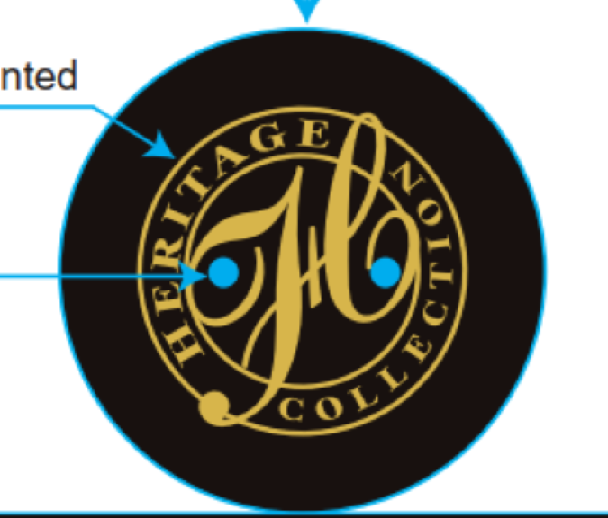

# TTB COLA Label Images - TTBID 23156001000960

**Brand Name:** PARKER'S HERITAGE COLLECTION

**Fanciful Name:** CASK STRENGTH

**Issue Date:** 06/06/2023

**Origin Code:** 22

**Product Class/Type:** 102

**Source:** [TTB Public COLA Registry](https://ttbonline.gov/colasonline/viewColaDetails.do?action=publicFormDisplay&ttbid=23156001000960)

## Label Images

### Back Label

### Label 1

### Label 3

### Label 4

### Label 5

## Extracted Label Text

*Text extracted via OCR - may contain errors*

*3 image(s) excluded: text did not meet readability threshold*

**Detected Proof:** 125
**Detected Age:** 10 Years

### Back Label

The I7th edition of the Parker $ Heritage Collection" consists of
10-year-old Kentucky Straight Rye Whiskey bottled at barrel
Aged across five different rickhouses and floors, the distillate
originally entered each barrel at 125
As the barrels continued
to
experience all four seasons of Kentucky weather, the
in each
barrel began to vary, depending On each barrel $ aging location: The
liquid was then expertly combined and bottled uncut and non-chill
filtered in order to preserve this Rye Whiskey in its purest form
A
portion of proceeds will continue to support
ALS research and patient care in honor of
Heaven Hill Distillery's Master Distiller
Emeritus Parker Beam.
7
GOVERNMENT WARNING; (0| ACCORDING TO THE SURGEON GENERAL,
8
WOMEN SHOULD NOT  DRINK ALCOHOLIC BEVERAGES DURING preG:
NANCY BECAUSE OF THE RISK OF BIRTH defects: (2) CONSUMPTION
4
OF ALCOHOLIC BEVERAGES IMPAIRS YOUR ABILITY TO DRIVE A CAR
2
OR OPERATe MAChINERV; AND MAY  CAuSe health PROBLEMS,
3
DISTILLED AND BOTTLED BY OLD HEAVEN HILL SPRINGS
DISTILLERY; BARDSTOWN, KY 40004 0 2023
240-8286
proof:
proof:
proof =

### Label 1

AGED
10
YEARS
KENTUCKY
STRAIGHT
W H I $
ye
CASK STRENGTH
ALC /VOL
62.5k PROOF125
240-8285
