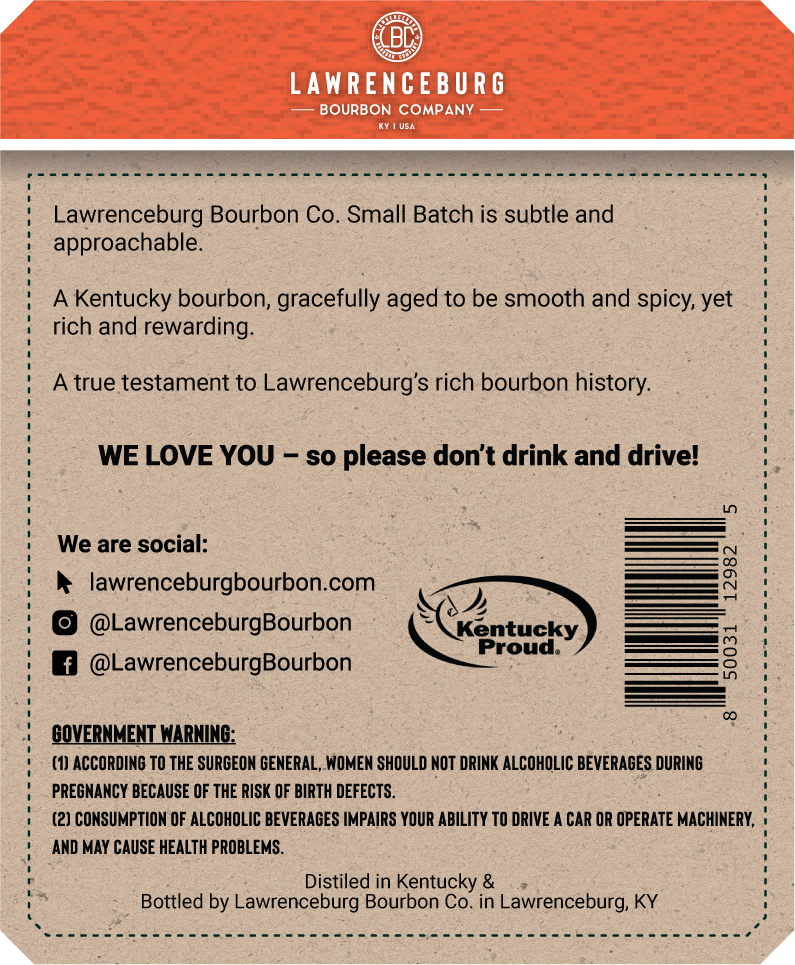
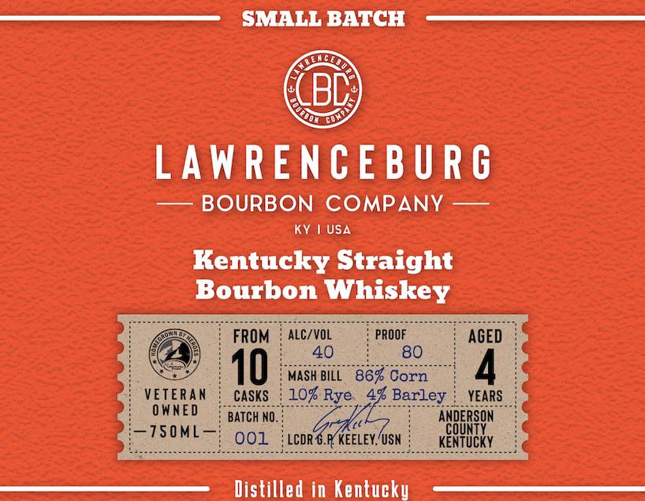

# TTB COLA Label Images - TTBID 23168001000036

**Brand Name:** LAWRENCEBURG BOURBON COMPANY

**Fanciful Name:** SMALL BATCH

**Issue Date:** 06/21/2023

**Origin Code:** 22

**Product Class/Type:** 101

**Source:** [TTB Public COLA Registry](https://ttbonline.gov/colasonline/viewColaDetails.do?action=publicFormDisplay&ttbid=23168001000036)

## Label Images

### Back Label

### Front Label

### Label 2

## Extracted Label Text

*Text extracted via OCR - may contain errors*

*1 image(s) excluded: text did not meet readability threshold*

### Back Label

LAWRENCE BURG
BOURBON COMPANY
Lawrenceburg Bourbon Co. Small Batch is subtle and
approachable
Kentucky bourbon, gracefully aged to be smooth and spicy,
rich and rewarding:
true testament to
Lawrenceburg's rich bourbon history:
WE LOVE YOU
so please don't drink and drivel
We are social:
lawrenceburgbourbon.com
8
@LawrenceburgBourbon
Kentucky
@LawrenceburgBourbon
Proud:
8
GQVERNMENT NARNING:
(1) ACCORDING TO THE SURCEON GENERAL, WOMEN SHOULD NOT DRINK ALCOHOLIC BEVERAGES DURING
PREGNANCY BECAUSE OF THE RISK OF BIRTH DEFECTS.
(2) CONSUMPTION OF ALCOHOLIC BEVERAGES IMPAIRS YOUR ABILITY TO DRIVE
CAR OR OPERATE MACHINERY,
AND MAY CAUSE HEALTH PROBLEMS.
Distiled in Kentucky &
Bottled by Lawrenceburg Bourbon Co. in Lawrenceburg; KY
yet

### Front Label

SMALL BATCH
LGE
(BD
LAWRENCE BU R G
BOURBON COMPANY
KY
USA
Kentucky Straight
Bourbon Whiskey
FROM
ALC/VOL
PROOF
AGED
40
80
10
MASH BILL
867 Corn
4
VETERAn
Casks
107 Rye
4% Barley
YEARS
0 WNED
BAtch NO,
~Z50ML_
ANBERSDN
001
LCDR G.R KEELEY, USN
KENTUCKY
Distilled in Kentucky
DDD
