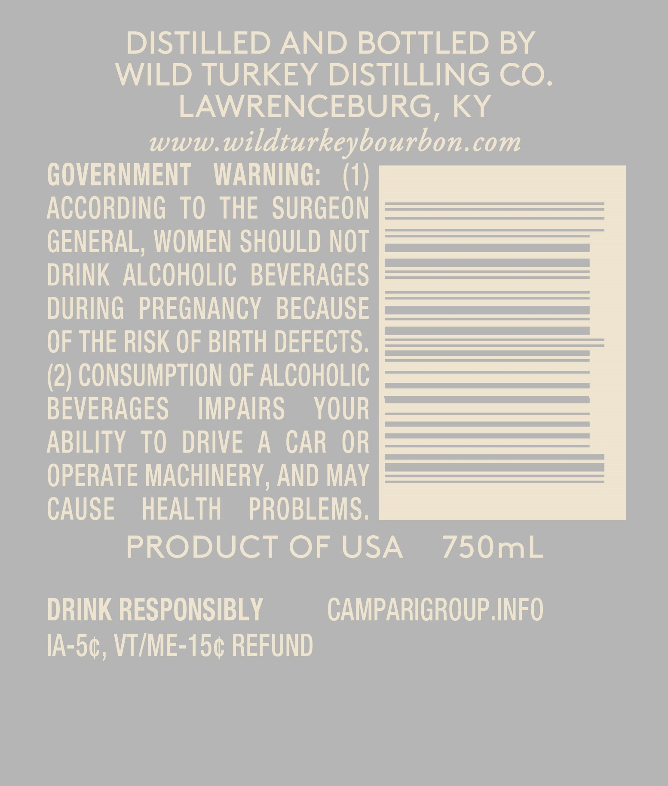
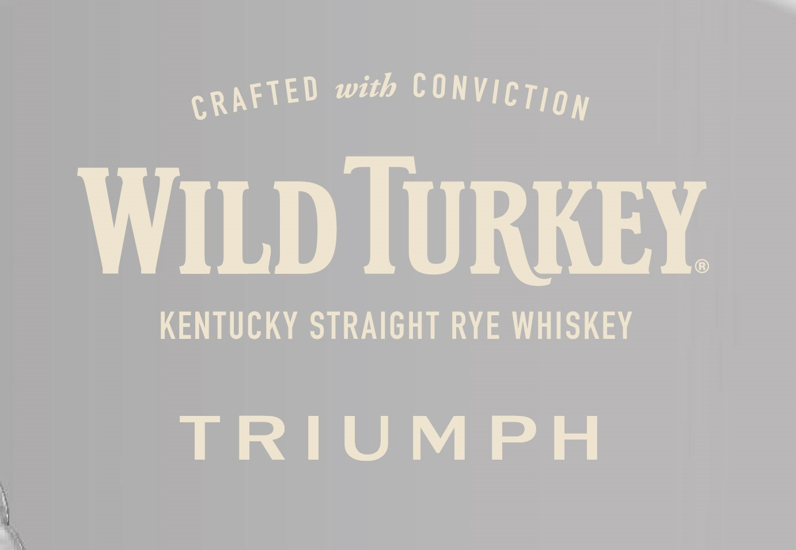
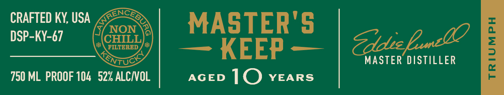

# TTB COLA Label Images - TTBID 23174001000306

**Brand Name:** WILD TURKEY

**Fanciful Name:** TRIUMPH

**Issue Date:** 06/27/2023

**Origin Code:** 22

**Product Class/Type:** 102

**Source:** [TTB Public COLA Registry](https://ttbonline.gov/colasonline/viewColaDetails.do?action=publicFormDisplay&ttbid=23174001000306)

## Label Images

### Back Label

### Front Label

### Label 3

### Label 4

## Extracted Label Text

*Text extracted via OCR - may contain errors*

*1 image(s) excluded: text did not meet readability threshold*

**Detected Proof:** 104
**Detected Age:** 10 Years

### Back Label

DISTILLED AND BOTTLED BY
WILD TURKEY DISTILLING CO_
LAWRENCEBURG, KY
www
wildturkeybourbon.com
GOVERNMENT
WARNING;
(1)
ACCORDING To THE SURGEON
GENERAL; WOMEN SHOULD NOT
DRINK ALCOHOLIC   BEVERAGES
DURING   PREGNANCY   BECAUSE
OF THE RISK OF BIRTH DEFECTS.
(2) CONSUMPTION OF ALCOHOLIC
BEVERAGES
IMPAIRS
YOUR
ABILITY TO
DRIVE
A
CAR  OR
OPERATE MACHINERY , AND MaY
CAUSE
HEALTH
PROBLEMS
PRODUCT OF USA
750mL
DRINK RESPONSIBLY
CAMPARIGROUP INFO
IA-50, VTIME-150 REFUND

### Front Label

with
WILD TURKEY
KENTUCKY STRAIGHT RYE WHISKEY
TRIUMPH
COnVIcTIon
CRAFTED

### Label 4

CRAFTED KY; USA
GENces
MASTER'S
NON
DSP-KY-67
CHILL
KEEP
ZddrEne
1
MASTER DISTILLER
750 ML PROOF 104   52% ALCIOL
AGED
10
YEARS
