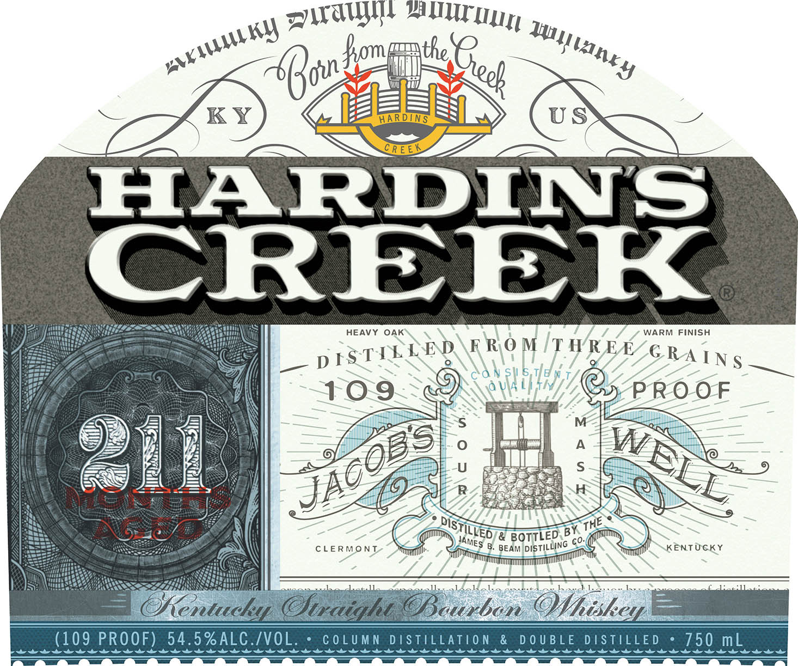
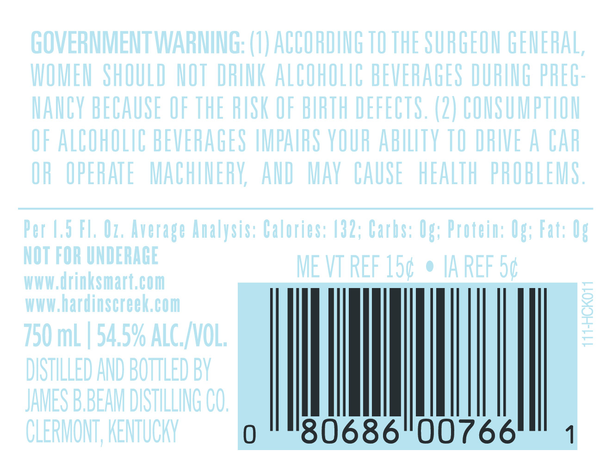

# TTB COLA Label Images - TTBID 23202001000263

**Brand Name:** HARDIN'S CREEK

**Issue Date:** 07/21/2023

**Origin Code:** 22

**Product Class/Type:** 101

**Source:** [TTB Public COLA Registry](https://ttbonline.gov/colasonline/viewColaDetails.do?action=publicFormDisplay&ttbid=23202001000263)

## Label Images

### Label 1

### Label 2

## Extracted Label Text

*Text extracted via OCR - may contain errors*

*1 image(s) excluded: text did not meet readability threshold*

### Label 1

Hay, l
W Jomprthe a)
» ‘i otis Re

MW
K Y

HEAVY OAK WARM FINISH

RAINS

eTre heD RROM THREE
AN SHE N

TILLED % 1

0/8 Bi ‘TED B

) Annes $8. esas oo
f

KENTUCKY
WAT

Bi bin Whiley

COLUMN DISTILLATION & DOUBLE DISTILLED * 750 mL
Cee ee ee ee er ee ee ee Oe et OO Oe On Or an Cr EE EEE
