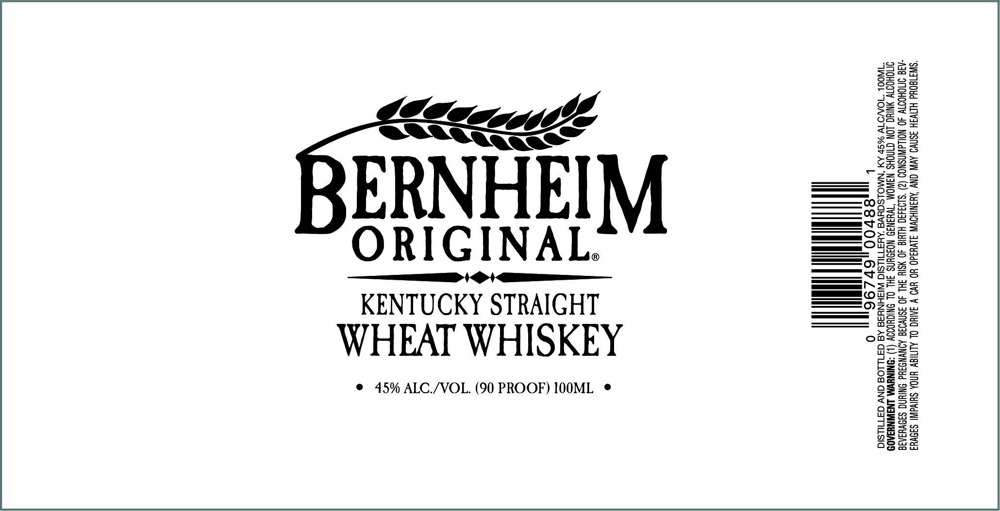

# TTB COLA Label Images - TTBID 23213001000417

**Brand Name:** BERNHEIM

**Fanciful Name:** WHEAT

**Issue Date:** 08/03/2023

**Origin Code:** 22

**Product Class/Type:** 109

**Source:** [TTB Public COLA Registry](https://ttbonline.gov/colasonline/viewColaDetails.do?action=publicFormDisplay&ttbid=23213001000417)

## Label Images

### Label 1

## Extracted Label Text

*Text extracted via OCR - may contain errors*

### Label 1

Gets

2s

SS

le",

Ox

Se

<5

@VBA8 5;

ON Cg

Z=8

eB

os

$5

O2

a

=

ERNHEI

Or

sO

ORIGINAL.

OWS S

a

Ors

Q2e

——— ee

EEE COS

KENTUCKY STRAIGHT

OZ

r£=2

2a

Pata’

oona=

WHEAT WHISKEY

gwo25

23

=a

Osea

as

© 45% ALC./VOL. (90 PROOF) 100ML ¢

=

=e

Ean

aa

bar 9=

ee

B=

#%

ao

oan

ae
