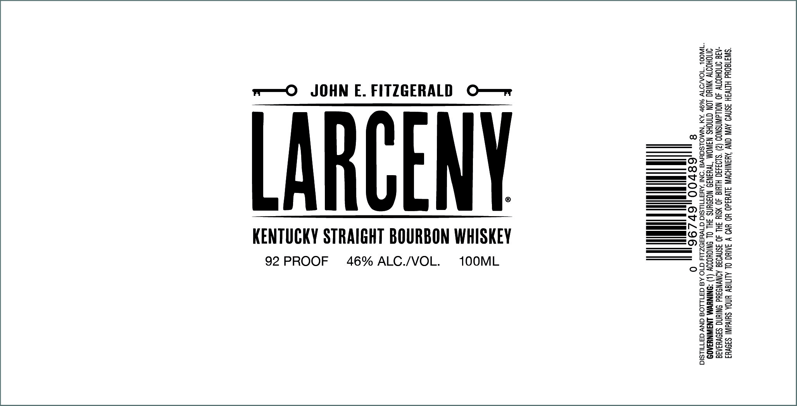

# TTB COLA Label Images - TTBID 23213001000431

**Brand Name:** LARCENY

**Issue Date:** 08/03/2023

**Origin Code:** 22

**Product Class/Type:** 101

**Source:** [TTB Public COLA Registry](https://ttbonline.gov/colasonline/viewColaDetails.do?action=publicFormDisplay&ttbid=23213001000431)

## Label Images

### Label 1

## Extracted Label Text

*Text extracted via OCR - may contain errors*

### Label 1

Sou

SoS

-Beon

Ss3a

cay

as

o22=

sese2

w—O JOHN E. FITZGERALD O—r

Sy

O=B=25

8S2u

sy

+SaS

S258

——I

Zee

£520

es

05-8.

FHS

aZzs

o2=S=

ee OS

CEBSe

I

R=

es SS

CSESaS

ee © FO

425

=—atny

oe © 1

16su

3B

Zoe

LARCENY

O55e>

ODBBe

a

Stou=S

E-een

KENTUCKY STRAIGHT BOURBON WHISKEY

a (CO) =

ew

eo Ss

OG2uu

ce

S=8

2a

92 PROOF 46% ALC./VOL.

1OOML

rSsso

o8se

oa

>oes

oS

aSs=z

2a

=o

aif =

v=

a=

Ee

ge

B=

<Seg5

oss

tees

Gc

as

as
