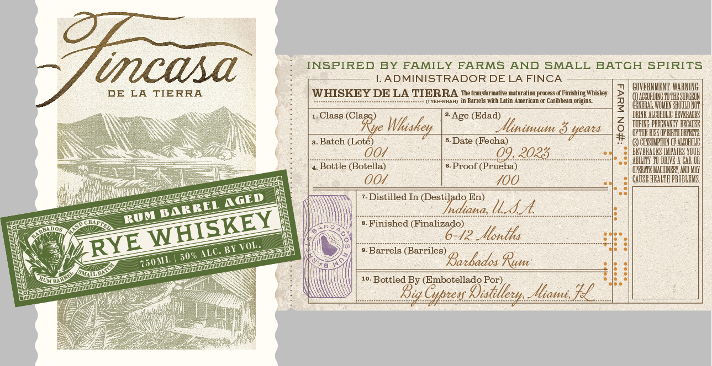

# TTB COLA Label Images - TTBID 23220001000159

**Brand Name:** FINCASA

**Issue Date:** 08/11/2023

**Origin Code:** 16

**Product Class/Type:** 142

**Source:** [TTB Public COLA Registry](https://ttbonline.gov/colasonline/viewColaDetails.do?action=publicFormDisplay&ttbid=23220001000159)

## Label Images

### Label 1

### Label 2

## Extracted Label Text

*Text extracted via OCR - may contain errors*

*1 image(s) excluded: text did not meet readability threshold*

**Detected Proof:** 100

### Label 1

incasa
INSFIRED
EY FAMILY FARMS
AND
SMALL BATCH SPIRITS
I.ADMINISTRADOR DE LA FINCA
GOVBRKHENT WARNING:
DE
LA
TIERRA
WHISKEY DE LA TIERRA
The transformatite maturation process of Finishing Whiskey
() ADCORDINGHU THE SOREEOH
TYEARRAH)
in Barrels with Latin Anerican e
Caribbean origins
2
GENERAL WOHEH SHOUII
Class
Age (Edad)
ALCDHDLIE
VERAEBS
Wkiskey
Syeats
3
Batch (Lote)
Date (Fecha)
#
LULMP HU
004
09.2023
VBRAGES
Bottle (Botella)
Proof (Prueba)
UEKHE
00
400
CAUSE HEALC
Distilled In (Destilado En)
Indiona, LL
Finished (Finalizado)
6-42 Aontha
BI
Barrels (Barriles)
50%
Batbados Rum
Bottled By (Embotellado Por)
Rig Cptes Distlleun_Ihans
(@larye
llinisum
muli
WIIII
uT
TMtA
AGED
BARREL
RUM
WHISKEY
RYE
VOL_
ALC.
Wmunowc
{SOML
