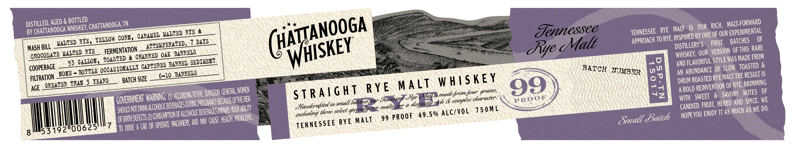

# TTB COLA Label Images - TTBID 23299001000796

**Brand Name:** CHATTANOOGA WHISKEY

**Fanciful Name:** TENNESSEE RYE MALT, 99 RYE

**Issue Date:** 10/27/2023

**Origin Code:** 43

**Product Class/Type:** 140

**Source:** [TTB Public COLA Registry](https://ttbonline.gov/colasonline/viewColaDetails.do?action=publicFormDisplay&ttbid=23299001000796)

## Label Images

### Label 1

### Label 2

