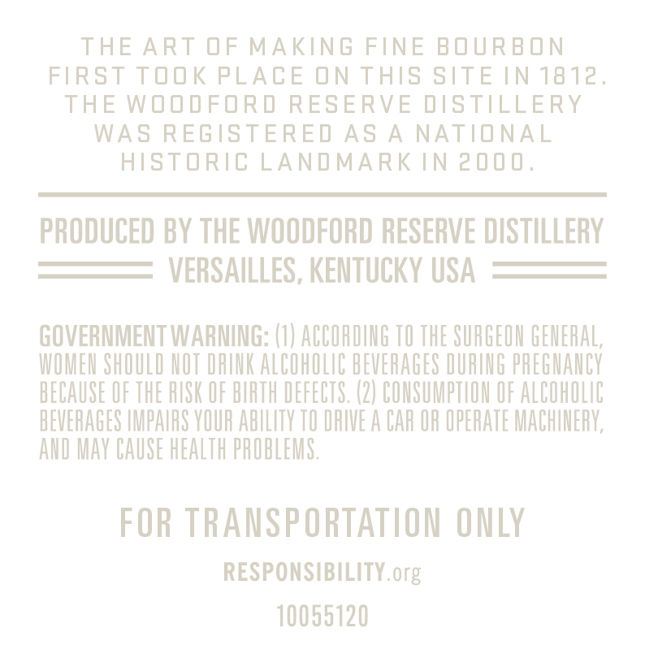
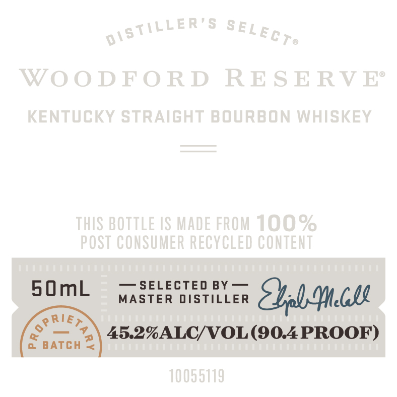

# TTB COLA Label Images - TTBID 23306001000674

**Brand Name:** WOODFORD RESERVE

**Issue Date:** 11/07/2023

**Origin Code:** 12

**Product Class/Type:** 101

**Source:** [TTB Public COLA Registry](https://ttbonline.gov/colasonline/viewColaDetails.do?action=publicFormDisplay&ttbid=23306001000674)

## Label Images

### Back Label

### Front Label

## Extracted Label Text

*Text extracted via OCR - may contain errors*

### Back Label

THE ART OF MAKING FINE BOURBON

FIRST TOOK PLACE ON THIS SITE IN 1812.

THE WOODFORD RESERVE DISTILLERY

WAS REGISTERED AS A NATIONAL

HISTORIC LANDMARK IN 2000.

PRODUCED BY THE WOODFORD RESERVE DISTILLERY

VERSAILLES, KENTUCKY USA

GOVERNMENT WARNING: (1) ACCORDING TO THE SURGEON GENERAL,

WOMEN SHOULD NOT DRINK ALCOHOLIC BEVERAGES DURING PREGNANCY

BECAUSE OF THE RISK OF BIRTH DEFECTS. (2) CONSUMPTION OF ALCOHOLIC

BEVERAGES IMPAIRS YOUR ABILITY TO DRIVE A CAR OR OPERATE MACHINERY,

AND MAY CAUSE HEALTH PROBLEMS.

FOR TRANSPORTATION ONLY

RESPONSIBILITY. org

10055120

### Front Label

SOmb  yasten vistitier Sol: Mell
RIE
(SED 45.2%ALC/VOL(90.4PROOF)
