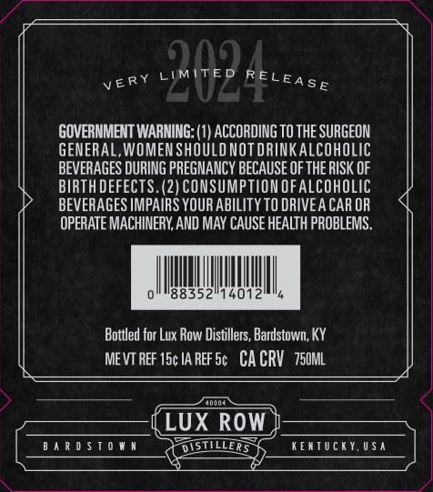
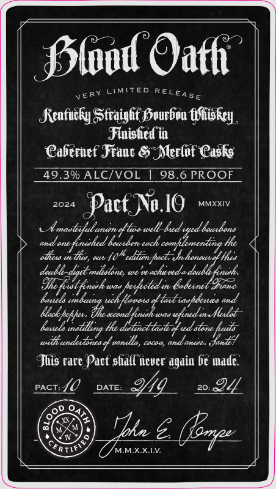
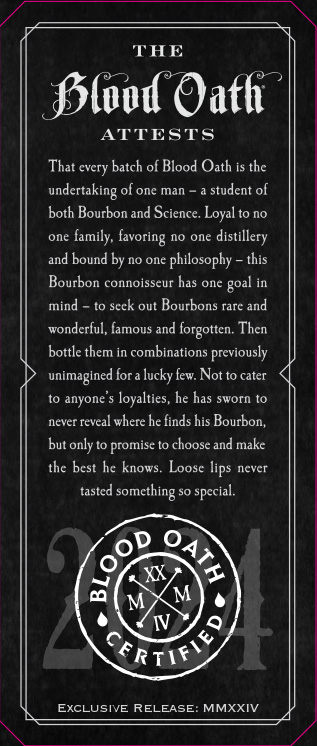

# TTB COLA Label Images - TTBID 23307001000383

**Brand Name:** BLOOD OATH

**Fanciful Name:** PACT NO. 10

**Issue Date:** 11/15/2023

**Origin Code:** 29

**Product Class/Type:** 641

**Source:** [TTB Public COLA Registry](https://ttbonline.gov/colasonline/viewColaDetails.do?action=publicFormDisplay&ttbid=23307001000383)

## Label Images

### Back Label

### Front Label

### Label 3

### Label 4

### Label 5

## Extracted Label Text

*Text extracted via OCR - may contain errors*

*1 image(s) excluded: text did not meet readability threshold*

**Detected Proof:** 98.6

### Back Label

'QuD
GOVERNMENT WARNING: (1) ACCORDING TO THE SURGEON
GENERAL,WOMEN SHOULD NOT dRINKalcohOlIc
BEVERAGES DURING PREGMANCY BECAUSE OF THE RISK OF
BIRTH DEFECTS. (2) CONSUMPTION Ofalcoholic
BEVERAGES IMPAIRS YOUR ABILITY TO DRIVEA CAR OR
OPERATE MACHINERY AND MAY CAUSE HEALTH PROBLEMS
88352"14012
Bottled for Lux Row Distillers, Bardstown, KY
MEVT REF 15c IA REF Sc   CA CRV   75OML
LUX ROw
B ^ R 0 $ T 0 W n
DUSTILLERS
KenTuciY,USa
ELEASE
VERY

### Front Label

fslod Oath
RY
LIMTTED
E4
v E
5 E
Rcnfucly SSfraighf Svurben fVhiskry_
Finished @
Cabernef Jranc &.Alerlof Casks
49.3% ALCIVOL
98.6 PROOF
2024
Pacf No.1O
MMXXIV
Umasttuluren
led ued Icvxbons
and an
Louuben tach .
Fhc
Tus ,
(t-
edlen pact Jn_
232
doadl
'veachuveda
Inueh.
Shte.
82
Id
pexkete i Gabeunet Iane
bamelo
aaaha
Lavat
dtaitiaapdeuas
&candtiueh was
Melt
banels
He
wii undexdones % vndla,
ccad;
annd
"Iaa
Jhis rarc Pact shall nevcr again bc madc.
PACT
40
DATE
219
20. @4
Iue (ezp
FTIt
MMXXLV
REL
uxll_
%tea _
efenhed 2
Jok
Mleck peffu;
"Zeaazeniaet
Taatllng "

### Label 3

THE
Sslood Oath
ATTESTS
That cvery batch of Blood Oath is the
undertaking of one man
student of
both Bourbon and Science. Loyal to no
one family; favoring no one
distillery
and bound by no one philosophy
this
Bourbon connoisscur has one
mind
to scck out Bourbons rare
wonderful, famous and
forgotten: Then
bottle
in combinations previously
unimagined for a lucky few Notto cater
to anyone
loyalties, he has sworn to
cvet
Teveal where he finds his Bourbon;
but only
promise t0 choose and make
thc best he knows
Loose lips never
tastcd
something
t
M
M
IV
EXCLUSIVE RELEASE
MMXXIV
goal
and
thcm
spccial.
8
~RTIf y

### Label 5

0
VERY LIMITED RELEASE
NEVER TO BE MADE AGAI
SRTIr>
4
