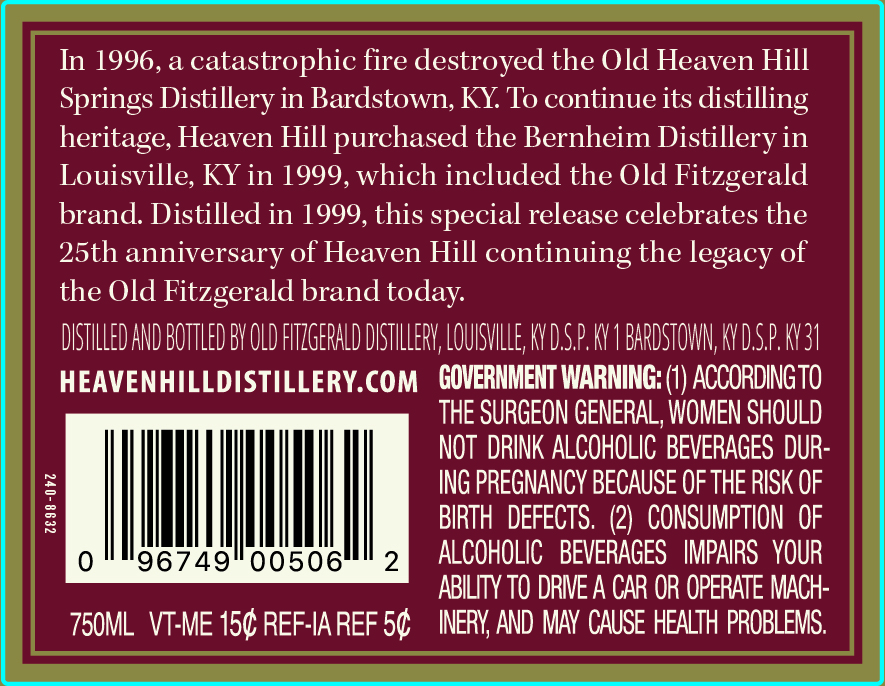
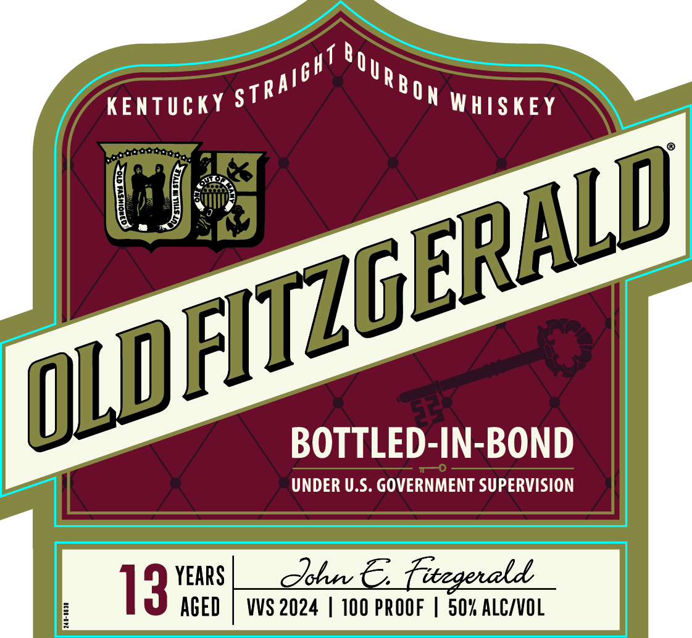
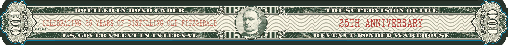

# TTB COLA Label Images - TTBID 23320001000289

**Brand Name:** OLD FITZGERALD

**Issue Date:** 11/17/2023

**Origin Code:** 22

**Product Class/Type:** 111

**Source:** [TTB Public COLA Registry](https://ttbonline.gov/colasonline/viewColaDetails.do?action=publicFormDisplay&ttbid=23320001000289)

## Label Images

### Back Label

### Label 1

### Label 3

## Extracted Label Text

*Text extracted via OCR - may contain errors*

### Back Label

In 1996, a catastrophic fire destroyed the Old Heaven Hill

Springs Distillery in Bardstown, KY. To continue its distilling

heritage, Heaven Hill purchased the Bernheim Distillery in

Louisville, KY in 1999, which included the Old Fitzgerald

brand. Distilled in 1999, this special release celebrates the

25th anniversary of Heaven Hill continuing the legacy of

the Old Fitzgerald brand today.

DISTILLED AND BOTTLED BY OLD FITZGERALD DISTILLERY, LOUISVILLE, KY DSP KY 1 BARDSTOWN, KY DSP KY3

HEAVENHILLDISTILLERY.COM GOVERNMENT WARNING: (1) ACCORDINGTO

THE SURGEON GENERAL, WOMEN SHOULD

NOT DRINK ALCOHOLIC BEVERAGES DUR

ING PREGNANCY BECAUSE OF THE RISK OF

|

|

|

BIRTH DEFECTS. (2) CONSUMPTION OF

96749" 00506

ALCOHOLIC BEVERAGES IMPAIRS YOUR

ABILITY TO DRIVE A CAR OR OPERATE MACH

750ML VT-ME 15¢ REF-IAREF 5¢  INERY, AND MAY CAUSE HEALTH PROBLEMS.

### Label 1

KENTUCKY 5

zRa!

ON WHISKEY

ls

as

BOTTLED-IN-BOND

UNDER U.S. GOVERNMENT SUPERVISION

YEARS

AGED

### Label 3

(anor ean noND UNDER ley, SUPER Vision OTE
eS OVERNMENT EN-TNTETEN ALM Pl A REVENUE BONDED WAREHOUSE >. Gum
