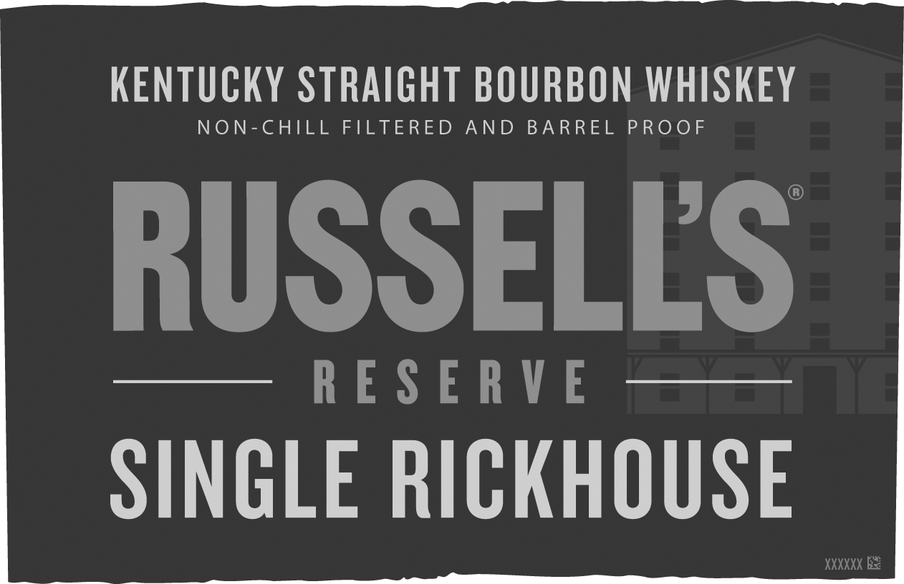
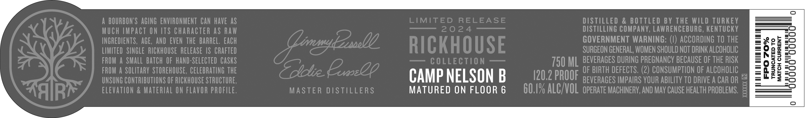

# TTB COLA Label Images - TTBID 23347001000544

**Brand Name:** RUSSELL'S RESERVE

**Fanciful Name:** SINGLE RICKHOUSE

**Issue Date:** 12/14/2023

**Origin Code:** 22

**Product Class/Type:** 101

**Source:** [TTB Public COLA Registry](https://ttbonline.gov/colasonline/viewColaDetails.do?action=publicFormDisplay&ttbid=23347001000544)

## Label Images

### Label 1

### Label 2

### Label 3

## Extracted Label Text

*Text extracted via OCR - may contain errors*

*1 image(s) excluded: text did not meet readability threshold*

### Label 1

KENTUCKY STRAIGHT BOURBON WHISKEY

NON-CHILL FILTERED AND BARREL PROOF

RUSSELLS

—— RESERVE ——

SINGLE RICKHOUSE —

XXXXXX

### Label 2

rarer allie ee ae
AN3YYND HOLVIN
Ol GALVONNYL
%OZ Ods

9,00000
| a

co
=
—)
~”
all
Lada
=
ou.
—
=
rE)

MATURED ON FLOOR 6
