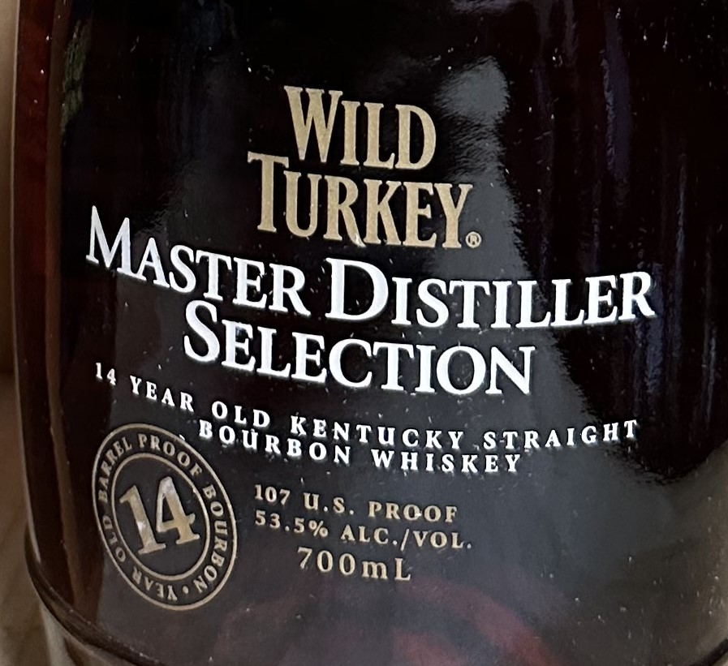
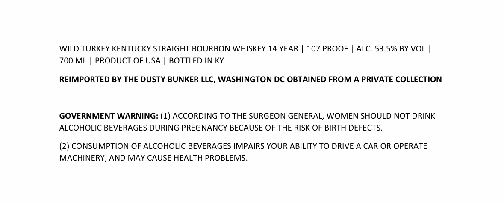

# TTB COLA Label Images - TTBID 23352001000207

**Brand Name:** WILD TURKEY

**Fanciful Name:** MASTER DISTILLER SELECTION 14 YEAR 107 PROOF

**Issue Date:** 12/20/2023

**Origin Code:** 00

**Product Class/Type:** 101

**Source:** [TTB Public COLA Registry](https://ttbonline.gov/colasonline/viewColaDetails.do?action=publicFormDisplay&ttbid=23352001000207)

## Label Images

### Label 1

### Label 2

## Extracted Label Text

*Text extracted via OCR - may contain errors*

### Label 1

WILD

1

RKEY, ©

‘

GER ¢ DISTILLER

ECTION

oire f

K

SNTUCKY. STRAIGHT

wu.

ON WHI.

oO

¥

Tele

C./VOL

Erehy

### Label 2

WILD TURKEY KENTUCKY STRAIGHT BOURBON WHISKEY 14 YEAR | 107 PROOF | ALC. 53.5% BY VOL |

700 ML | PRODUCT OF USA | BOTTLED IN KY

REIMPORTED BY THE DUSTY BUNKER LLC, WASHINGTON DC OBTAINED FROM A PRIVATE COLLECTION

GOVERNMENT WARNING: (1) ACCORDING TO THE SURGEON GENERAL, WOMEN SHOULD NOT DRINK

ALCOHOLIC BEVERAGES DURING PREGNANCY BECAUSE OF THE RISK OF BIRTH DEFECTS.

(2) CONSUMPTION OF ALCOHOLIC BEVERAGES IMPAIRS YOUR ABILITY TO DRIVE A CAR OR OPERATE

MACHINERY, AND MAY CAUSE HEALTH PROBLEMS.
