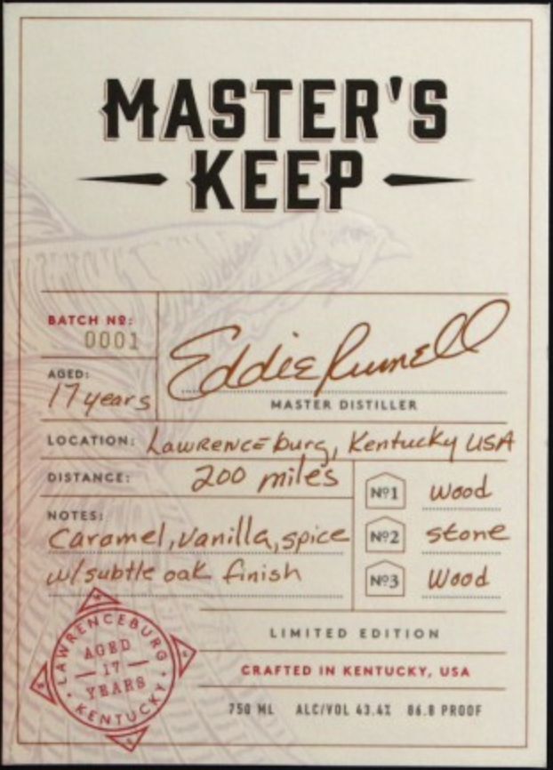
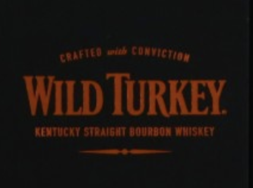
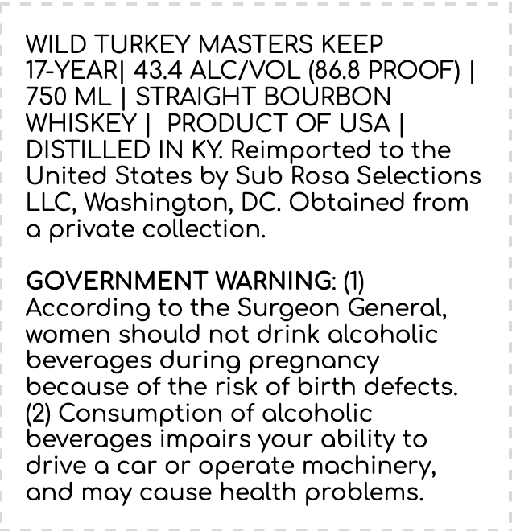

# TTB COLA Label Images - TTBID 23364001000027

**Brand Name:** WILD TURKEY

**Fanciful Name:** MASTERS KEEP 17-YEAR

**Issue Date:** 01/04/2024

**Origin Code:** 00

**Product Class/Type:** 101

**Source:** [TTB Public COLA Registry](https://ttbonline.gov/colasonline/viewColaDetails.do?action=publicFormDisplay&ttbid=23364001000027)

## Label Images

### Front Label

### Label 2

### Label 3

## Extracted Label Text

*Text extracted via OCR - may contain errors*

*1 image(s) excluded: text did not meet readability threshold*

### Front Label

MASTER'S
nee —

AGED:

17 year wasten ousticien
Location haweence burs, Kentucky usA

DISTANCE: _ God miles |

NOTES:

ae nilla, ace! wa] Sone
wi subtle oak, Lnish no3) Wood

BATCH N®@:
0002 clin

Nel Wood

LIMITED EDITION

CRAFTED IN KENTUCKY, USA

TSE ML ALC/VOL 43.42 84.8 PROOF

### Label 3

WILD TURKEY MASTERS KEEP

17-YEAR| 43.4 ALC/VOL (86.8 PROOF) |

780 ML | STRAIGHT BOURBON

WHISKEY | PRODUCT OF USA |

DISTILLED IN KY. Reimported to the

United States by Sub Rosa Selections

LLC, Washington, DC. Obtained from

a private collection.

GOVERNMENT WARNING: (1)

According to the Surgeon General,

women should not drink alcoholic

beverages during pregnancy

because of the risk of birth defects.

(2) Consumetion of alcoholic

beverages impairs your ability to

drive a car or operate machinery,

and may cause health problems.
