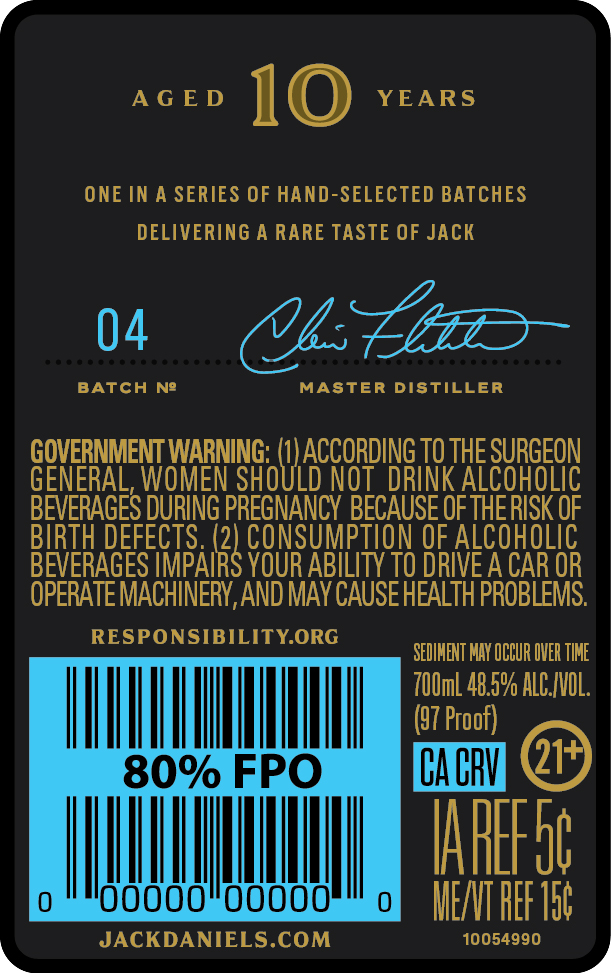
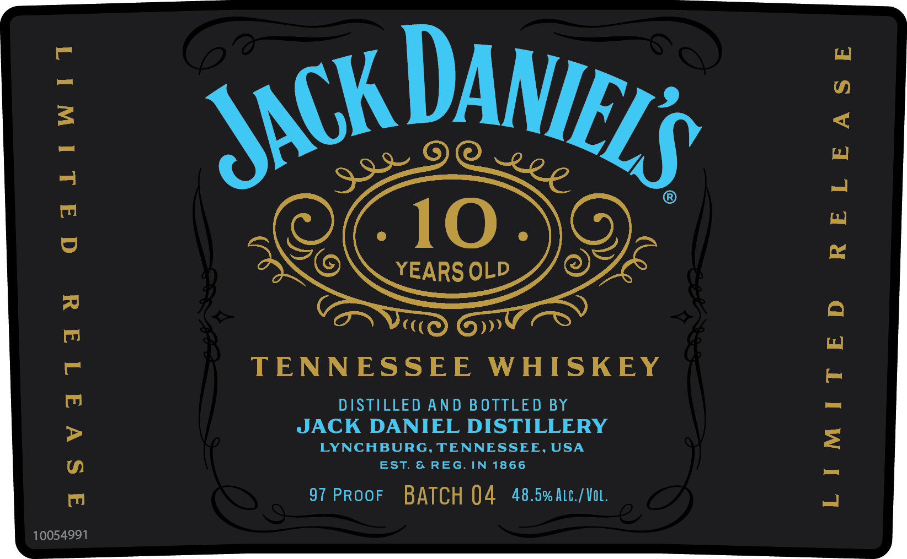

# TTB COLA Label Images - TTBID 24002001000457

**Brand Name:** JACK DANIEL'S

**Fanciful Name:** 10 YEARS OLD

**Issue Date:** 01/04/2024

**Origin Code:** 43

**Product Class/Type:** 140

**Source:** [TTB Public COLA Registry](https://ttbonline.gov/colasonline/viewColaDetails.do?action=publicFormDisplay&ttbid=24002001000457)

## Label Images

### Back Label

### Front Label

## Extracted Label Text

*Text extracted via OCR - may contain errors*

### Back Label

f »'
AGED ll (@) YEARS
ONE IN A SERIES OF HAND-SELECTED BATCHES
DELIVERING A RARE TASTE OF JACK
06 OEE
BATCH Ne MASTER DISTILLER
GOVERNMENT WARNING: cate TO THE SURGEON
GENERAL, WOMEN SHOULD NOT DRINK ALCOHOLIC
BEVERAGES DURING PREGNANCY BECAUSE OF THERISK OF
BIRTH DEFECTS. ee OF ALCOHOLIC
BEVERAGES IMPAIRS YOUR ABILITY T0 DRIVE A CAR OR
OPERATE MACHINERY, AND MAY CAUSE HEALTH PROBLEMS.
BLES rede es SEMEN HAY OUR OER TE
700ml 48.5% ALC.IVOL.
(97 Proof) P
wi OU W
0 | | AY WEATAGE St
Xv JACKDANIELS.COM 10054990 3

### Front Label

|

qaliwtit

aSvatad

10054991

TENNESSEE WHISKEY

DISTILLED AND BOTTLED BY
JACK DANIEL DISTILLERY
LYNCHBURG, TENNESSEE, USA
EST. & REG. IN 1866

97 PRooF BATCH 04 48.5% Atc./VoL.

|

RELEASE

LIMITED
