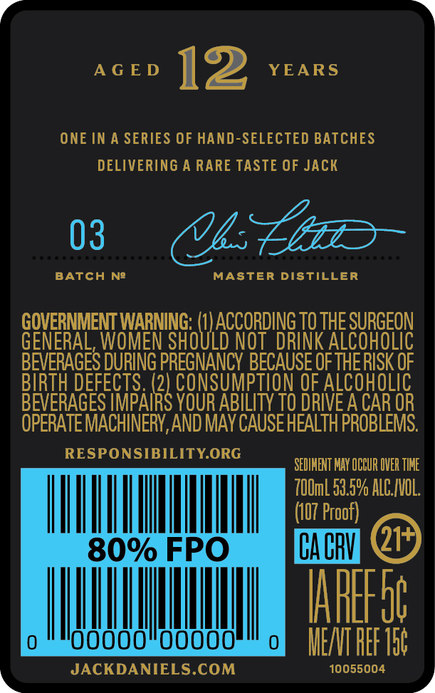
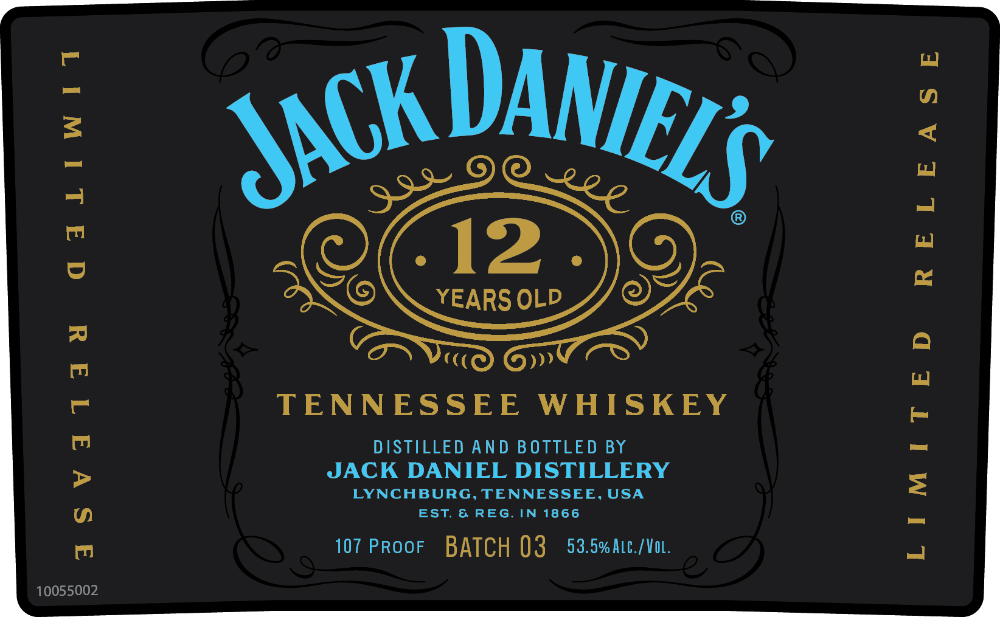

# TTB COLA Label Images - TTBID 24002001000458

**Brand Name:** JACK DANIEL'S

**Fanciful Name:** 12 YEARS OLD

**Issue Date:** 01/04/2024

**Origin Code:** 43

**Product Class/Type:** 140

**Source:** [TTB Public COLA Registry](https://ttbonline.gov/colasonline/viewColaDetails.do?action=publicFormDisplay&ttbid=24002001000458)

## Label Images

### Back Label

### Front Label

## Extracted Label Text

*Text extracted via OCR - may contain errors*

### Back Label

AGED 12 YEARS

ONE IN A SERIES OF HAND-SELECTED BATCHES

DELIVERING A RARE TASTE OF JACK

BATCH Ne

03 UL

MASTER DISTILLER

GENERAL,

GOVERNMENT WARNING: (1

0

5

ACCORDING 10 THE SURGEON

D

KA

|

BEVERAGES DURING a BECAUSE OF TH

BIRTH DEF

PTI

ALCOHOLIC

BEVERAGES IMBAlR

YOUR ABILITY TO DRIVE A CAR OR

OPERATE MACHINERY, AND MAY CAUSE HEALTH PROBLEMS.

RESPONSIBILITY.ORG

SEDIMENT MAY OCCUR OVER TIME

100ml 59.5% ALC./VOL.

|

|

|

|

|

|

|

i FPO

F m may

ras

|

|

‘wo

0000

00000

0

MEAT REF Tat

»

JACKDANIELS.COM

10055004

y

### Front Label

\ DAW

IE,

3

12.

ENG

YEARS OLD

OE

C((

»»

TENNESSEE WHISKEY

DISTILLED AND BOTTLED BY

JACK DANIEL DISTILLERY

LYNCHBURG, TENNESSEE, USA

EST. & REG. IN 1866

107 PRooF BATCH 03 53.5% Atc./VoL.

10055002
