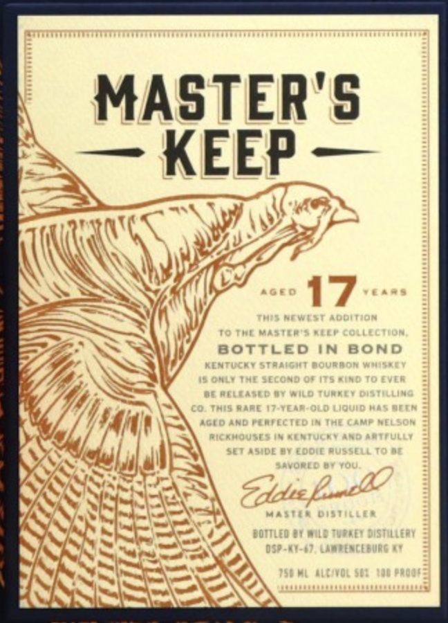
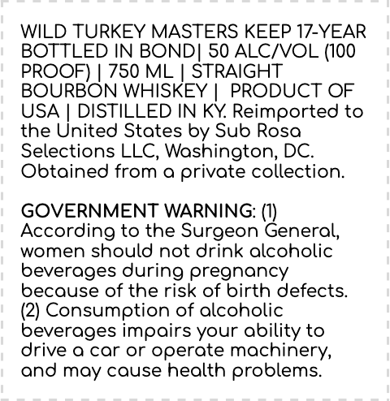
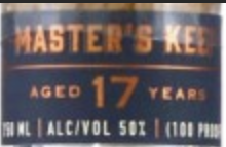

# TTB COLA Label Images - TTBID 24003001000076

**Brand Name:** WILD TURKEY

**Fanciful Name:** MASTERS KEEP 17-YEAR BOTTLED IN BOND

**Issue Date:** 01/03/2024

**Origin Code:** 00

**Product Class/Type:** 119

**Source:** [TTB Public COLA Registry](https://ttbonline.gov/colasonline/viewColaDetails.do?action=publicFormDisplay&ttbid=24003001000076)

## Label Images

### Front Label

### Label 2

### Label 3

## Extracted Label Text

*Text extracted via OCR - may contain errors*

*1 image(s) excluded: text did not meet readability threshold*

### Front Label

| MASTER'S
“a KEEP —
TIN \W Was
(Wa War
Z INS BOTTLED IN BOND
VA
AY. Ns SSS tat om HATER
SNS ese) sa
WSS
a KSISES :

### Label 2

WILD TURKEY MASTERS KEEP 17-YEAR

BOTTLED IN BOND] 50 ALC/VOL (100

PROOF) | 750 ML | STRAIGHT

BOURBON WHISKEY | PRODUCT OF

USA | DISTILLED IN KY. Reimported to

the United States by Sub Rosa

Selections LLC, Washington, DC.

Obtained from a private collection.

GOVERNMENT WARNING: (1)

women should not drink alcoholic

According to the Surgeon General,

beverages during pregnancy

because of the risk of birth defects.

(2) Consumption of alcoholic

beverages impairs your ability to

drive a car or operate machinery,

and may cause health problems.
