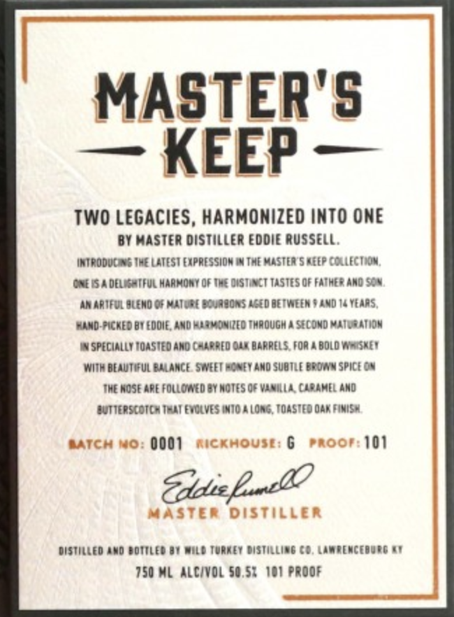
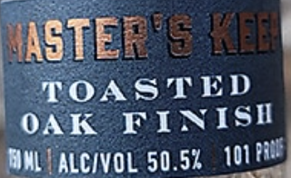
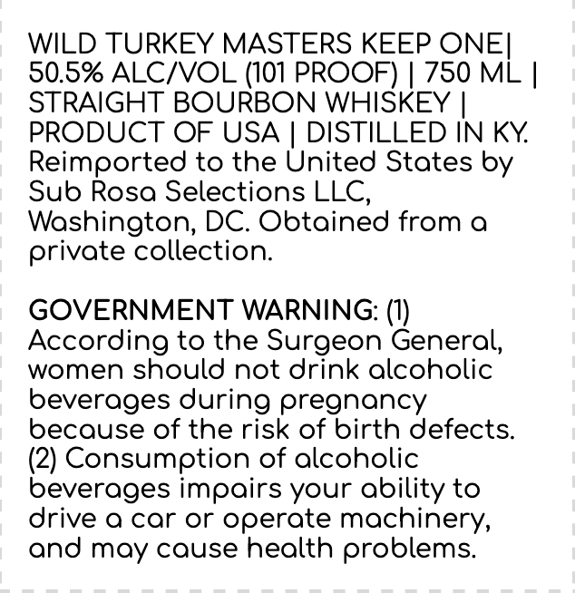

# TTB COLA Label Images - TTBID 24003001000096

**Brand Name:** WILD TURKEY

**Fanciful Name:** MASTERS KEEP ONE

**Issue Date:** 01/05/2024

**Origin Code:** 00

**Product Class/Type:** 101

**Source:** [TTB Public COLA Registry](https://ttbonline.gov/colasonline/viewColaDetails.do?action=publicFormDisplay&ttbid=24003001000096)

## Label Images

### Front Label

### Label 2

### Label 3

## Extracted Label Text

*Text extracted via OCR - may contain errors*

**Detected Proof:** 101

### Front Label

MASTER'5
KEEP
TWO LEGACIES, HARMONIZED IMTO ONE
By Haster distiller Eddie Russell,
Introdueas Ine LatEST Expressiom I4 Twe Mastea 5 fepcolleciion,
Gfg5a del :-Ful Harkort QF Ime @AST AcT TasTEs OF Fatme? Andsot
arAriful @lEndQe Maiug{ Doureoas 44{d detwEER $ ANd /4teaas,
Rand Ficned BI Eddie; And aeayonizeo [Mrough / SIcdndmaiutAtiQH
specially [oasiedaro g-arre0oln BarrELs Foa 4 BOLo (atsnet
Witk BEAUTIFUL Balance 5weetecnft And SubtLE Broa y spiceou
Iwe Hose Are Folloatdey Notes Of Vinila [IbahIl And
Juticrscoica Ieai euclves Inio 4 (ong, [Oasted 0ar Finist
AATCh No: 0001
RicKhOUsi: 6
Proor 101
Euluee_2
MaSTER Distiller
distilled And aoiiled0i Dile [URET Distilling (0, Lardenc{00tg 4
150 Hl Alcivol 50,51  I01 prqdf

### Label 2

NASTEE 5 {aa
TOASTED
OAK
FINISI
ALcivoL 50.52
101 RiV)
MML

### Label 3

WILD TURKEY MASTERS KEEP ONEI
50.5% ALCIVOL (101 PROOF)
750 ML |
STRAIGHT BOURBON WHISKEY
PRODUCT OF USA
DISTILLED IN KY
Reimported to the United States by
Sub Rosa Selections LLC,
Washington, DC. Obtained from 0
private collection:
GOVERNMENT WARNING: (W)
According to the Surgeon General,
women should not drink alcoholic
beverages during pregnoncy
because of the risk of birth defects
(2) Consumption of alcoholic
beverages impoirs your ability to
drive a car or operate
machinery,
and moy couse health problems:
