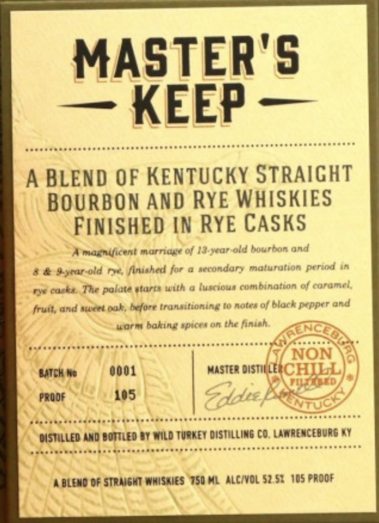
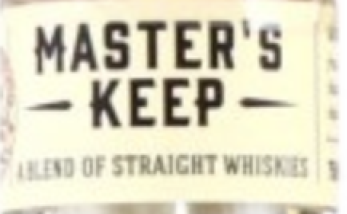
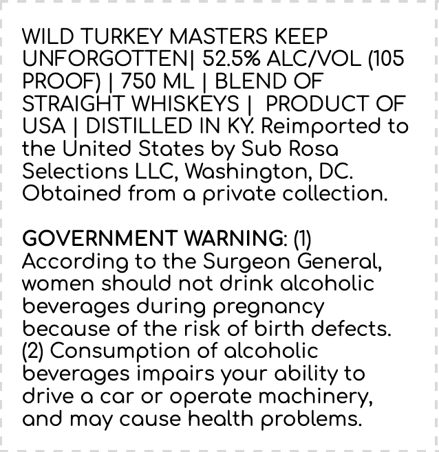

# TTB COLA Label Images - TTBID 24003001000105

**Brand Name:** WILD TURKEY

**Fanciful Name:** MASTERS KEEP UNFORGOTTEN

**Issue Date:** 01/11/2024

**Origin Code:** 00

**Product Class/Type:** 129

**Source:** [TTB Public COLA Registry](https://ttbonline.gov/colasonline/viewColaDetails.do?action=publicFormDisplay&ttbid=24003001000105)

## Label Images

### Front Label

### Label 2

### Label 3

## Extracted Label Text

*Text extracted via OCR - may contain errors*

### Front Label

MASTER'S

Acer

A BLEND OF KENTUCKY STRAIGHT

iJ

BOURBON AND RYE WHISKIES

FINISHED IN RYE CASKS

Wmagnificent marriage of 13-year-old bourbon and

indary matura

8 & Byrar-old rye, finished for a

ion of caram

aye casks, The palate gtarts with a fuse

fruit, and sweet oak, before transitioning to

-s of black pepper and

worm baking sprces on the

fint

finish

GENCED

fit,

Ss oP Sop aaa pamammaaaaaal

5/ N

BATCH We

0001

wre oisTH

(CHILL

Proof

105

ra

fess

4 rygseeY

AS

awa

NTUCY

poy

Ver edee: doebvdeebectdwesecgeeseeeerececseenesnseensnaneseasnner

Ke

DISTILLED AND

a dee bne tees bee

Livcacedeccctapsaceccscsscesecsncccccccceseeseeenens

LEO BY WILD TURKEY DISTILLING CO, LAWRENCEBURG KY

‘ { ABLENO OF STRAIGHT WnSHles “WSO ML ALC/VOL 52.5% 105 PROOF

‘

\

\)

### Label 2

MASTER'S .

F STRAIGHT WH

= . -

—

### Label 3

WILD TURKEY MASTERS KEEP

UNFORGOTTEN| 52.5% ALC/VOL (105

PROOF) | 750 ML | BLEND OF

STRAIGHT WHISKEYS | PRODUCT OF

USA | DISTILLED IN KY. Reimported to

the United States by Sub Rosa

Selections LLC, Washington, DC.

Obtained from a private collection

GOVERNMENT WARNING: (1)

According to the Surgeon General,

women should not drink alcoholic

beverages during pregnancy

because of the risk of birth defects

(2) Consumption of alcoholic

beverages impairs your ability to

drive a car or operate machinery,

and may cause health problems.
