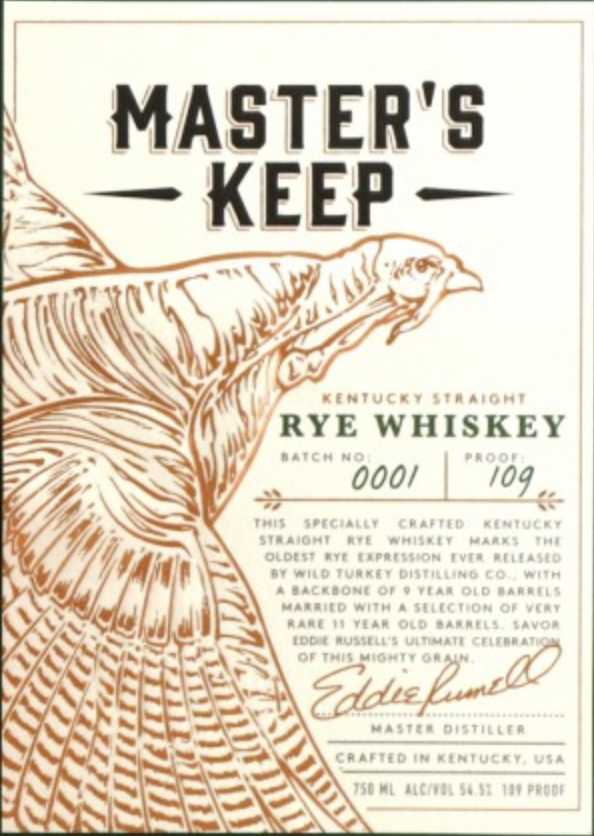
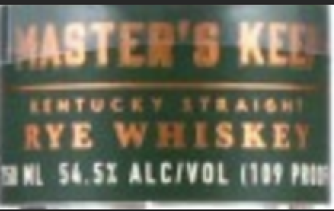
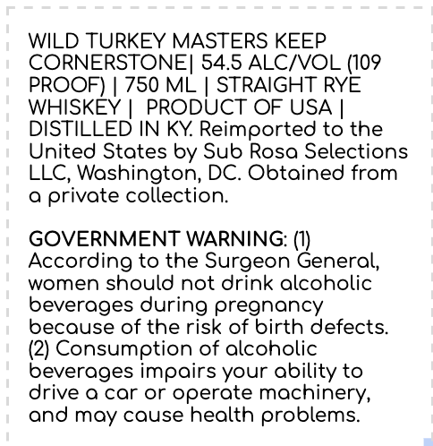

# TTB COLA Label Images - TTBID 24003001000117

**Brand Name:** WILD TURKEY

**Fanciful Name:** MASTERS KEEP CORNERSTONE

**Issue Date:** 01/03/2024

**Origin Code:** 00

**Product Class/Type:** 102

**Source:** [TTB Public COLA Registry](https://ttbonline.gov/colasonline/viewColaDetails.do?action=publicFormDisplay&ttbid=24003001000117)

## Label Images

### Front Label

### Label 2

### Label 3

## Extracted Label Text

*Text extracted via OCR - may contain errors*

### Front Label

MASTER'S

— KEEP

i

AN

WA

\Wayjr-

N S

\

SS

»

RYE WHISKEY

1 Vj

hy

ee

m

Y

A)

ss

Gpidicfant?

~ ~)

EB sci.

aster

TWN STS

XX

### Label 2

.

t

———

—_

tate

alge

YE \

SKE

ML $4.51 ALC/VOL (109

### Label 3

WILD TURKEY MASTERS KEEP

CORNERSTONE| 54.5 ALC/VOL (109

PROOF) | 750 ML | STRAIGHT RYE

WHISKEY | PRODUCT OF USA |

DISTILLED IN KY. Reimported to the

United States by Sub Rosa Selections

LLC, Washington, DC. Obtained from

a private collection.

GOVERNMENT WARNING: (1)

According to the Surgeon General,

women should not drink alcoholic

beverages during pregnancy

because of the risk of birth defects.

(2) Consumption of alcoholic

beverages impairs your ability to

drive a car or operate machinery,

and may cause health problems.
