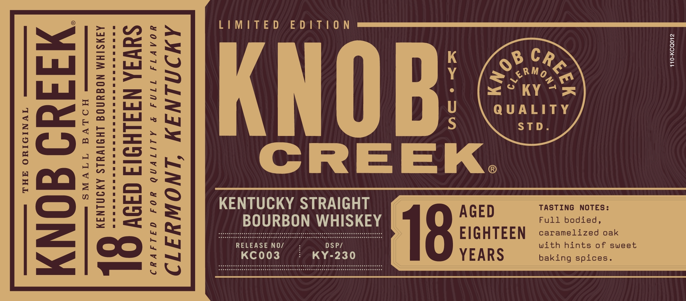
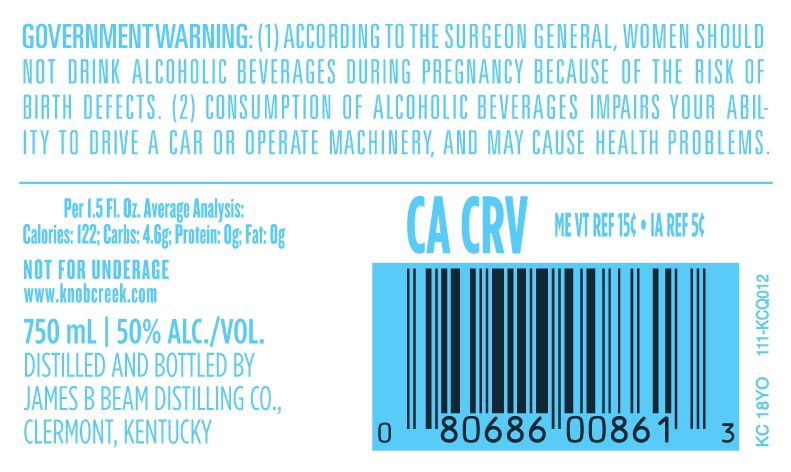
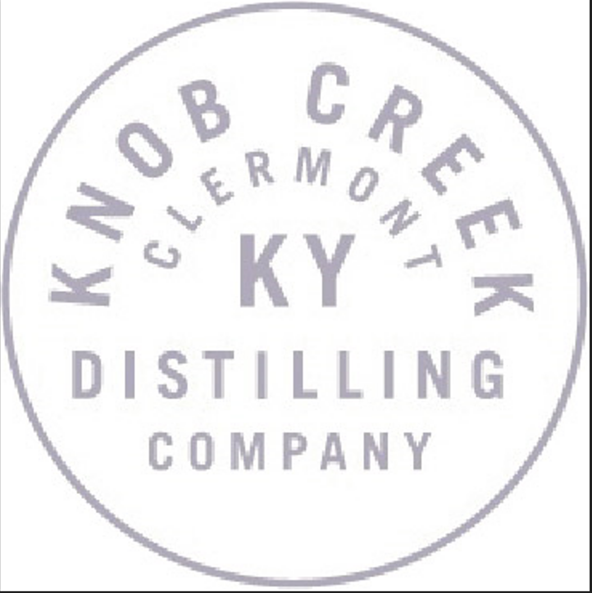

# TTB COLA Label Images - TTBID 24008001000177

**Brand Name:** KNOB CREEK

**Issue Date:** 01/09/2024

**Origin Code:** 22

**Product Class/Type:** 101

**Source:** [TTB Public COLA Registry](https://ttbonline.gov/colasonline/viewColaDetails.do?action=publicFormDisplay&ttbid=24008001000177)

## Label Images

### Label 1

### Label 2

### Label 3

### Label 4

## Extracted Label Text

*Text extracted via OCR - may contain errors*

*2 image(s) excluded: text did not meet readability threshold*

**Detected Proof:** 100

### Label 1

4
LIMITE D
E D |T|0 N
I
1
8
1
1
EkNob
Quaity
1
1
1
4
5
STD
3
[
1
CREEK
4
F
C
3
8
Ila
:
0
1
KeNoRBOSTRHGKEY
AGED
F4sTIbodieds:
18
EIGHTEEN
caramelized
oak
RELEASE NO/
DSP/
With hints 0f
sweet
21
KC003
KY-230
YEARS
baking spices _
0
0 B
~~ERmo

### Label 3

GOVERMMENT WARMING: (I) ACCORDING TO THE SURGEOH GEMERAL, WOMEN ShOULD
NOT  DFINK ALCOHOLIC BEVERAGES DURING PREGMANCV BECAUSE OF ThE RUSK OF
BIRTH DEFECTS, (2) CONSUMPTLON OF ALCOHOLIC BEVERAGES IMPAURS VOUR AbIL:
ITY TO DRIVE A CAR OR OPERATE MACHIMERV; AND MAv CAUSE HEALTh PROBLEMS.
Per U,5 FL Oz, Average Analysis:
Calories: (22; Carbs: 4.6g; Protein: Ug Fac Ug
CA CRV
MEVT REF 154 ' IA REF 54
NOT FOR UNDERACE
WWw knobereek Com
750 mL
50% ALC_/VOL;
1
DISTILLED AND BOTTLED BY
JAMES B BEAM DISTILLING CO,
2
CLERMONT, KENTUCkV
'80686"0086
3
2
