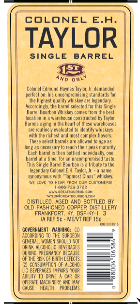
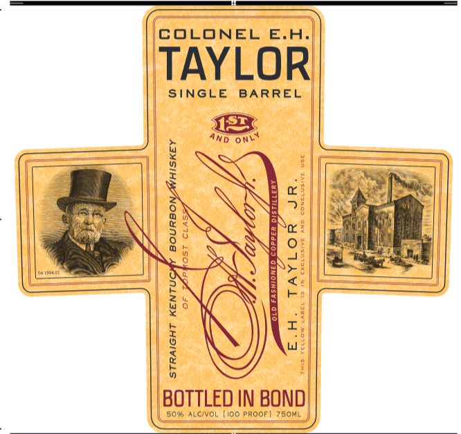
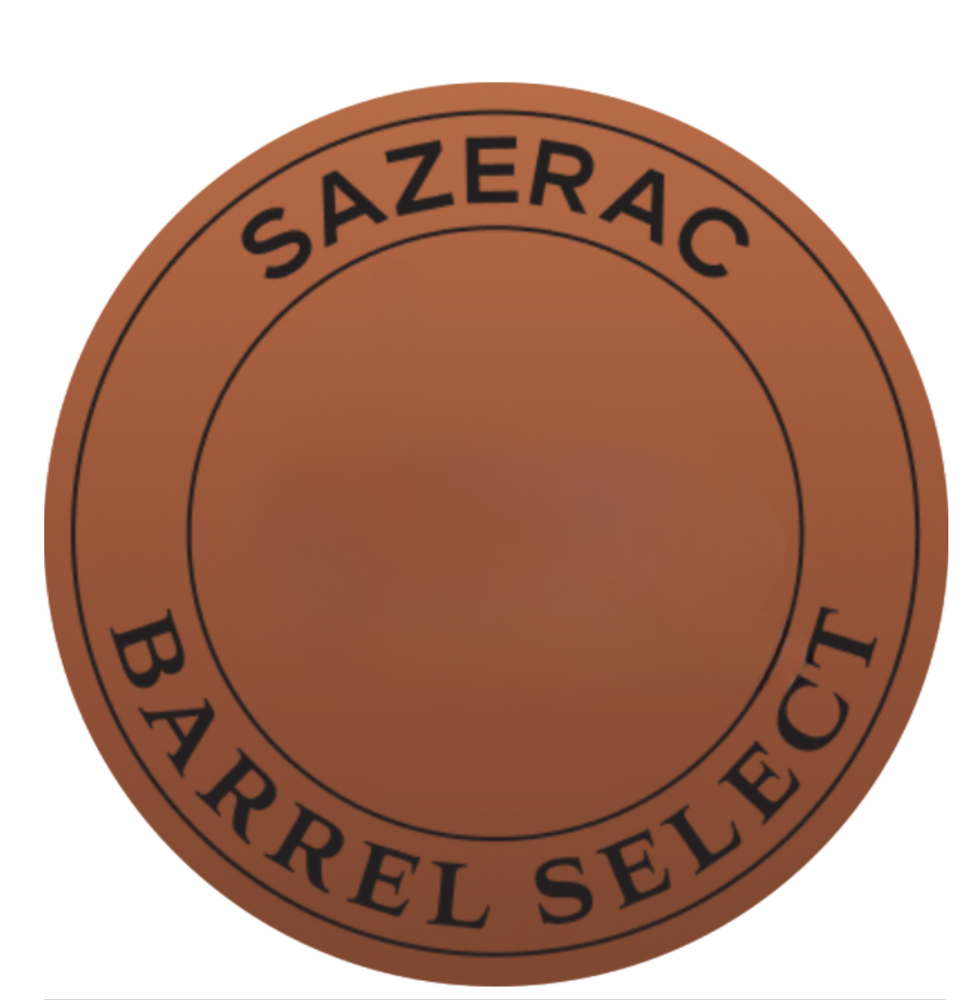

# TTB COLA Label Images - TTBID 24009001000049

**Brand Name:** COLONEL E.H. TAYLOR

**Fanciful Name:** SBS

**Issue Date:** 01/10/2024

**Origin Code:** 22

**Product Class/Type:** 101

**Source:** [TTB Public COLA Registry](https://ttbonline.gov/colasonline/viewColaDetails.do?action=publicFormDisplay&ttbid=24009001000049)

## Label Images

### Back Label

### Front Label

### Label 3

## Extracted Label Text

*Text extracted via OCR - may contain errors*

*2 image(s) excluded: text did not meet readability threshold*

### Back Label

COLONEL
E.A
TAYLOR
SinGLE
BARREL
OnL
Colarel Edinurd Haynes Tavlor,
derarced
perlec Uon; Ws Wrcompromising stamdards lor
hphest quallly whskey are lependary;
Hclurdiai
Ue barrel seleoted (oc Us Sinale
Barrel Boubo
comes Urou Uhe best
Iucagl
warehouse € uustr ucted
avlun;
Barrels aging
Uhe heart
warehouses
(jutirell ewaluated '
Idertily mhisKeys
Ue tichest ad mst compler Ilawors,
These
allowed
ape US
Icuug
ILECUssIn
60uCM
Uhelr peak malucUy;
Each
Uem boulled Irdividuall one
CnA
Ue ,
an uncorprommised (asle
Siele Barrel Boutbon
Urbute
E nendal
Colowele H; Taylor; =
Mame
synonyious with "Topmost Class " whiskey;
HeAr FRC'
GusiokRS
UEeUEea
Net Ciaraukhdhcak
Ilakakearaukhah cap
DISTILLED;
AGED AND BOTTLED BY
OLD FASHIONED COPPER DISTILLERY
FRANKFORT, KY, DSP-KY-//3
IA ReF 5c
MEIVT REF 150
CMLmI
GOVERMMEMT   WarMING:
ACCORDInG
THE SURCEOM
GENERAL , WDMEM ShOuld Not
DRINKALCOHOLIC BEVERAGES
DURING PAEGMANCY BECAUSE
OF THE RUSK @F
URTH DEFECTS,
(2) CorSuMpior OF ALCOHD
BEWEAAGES  MAPAIRS  YQUR
ABILTY
DRIE
CAR OR
OPERATE WACHINERY And MaY
CAUSE
MEALTH
PROBLEMS,
AND
mhlishey
Uese
bantels
barte
Ta
