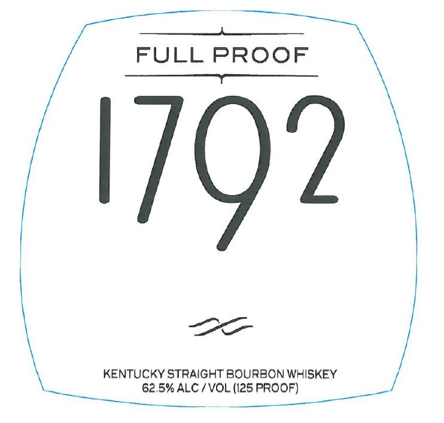
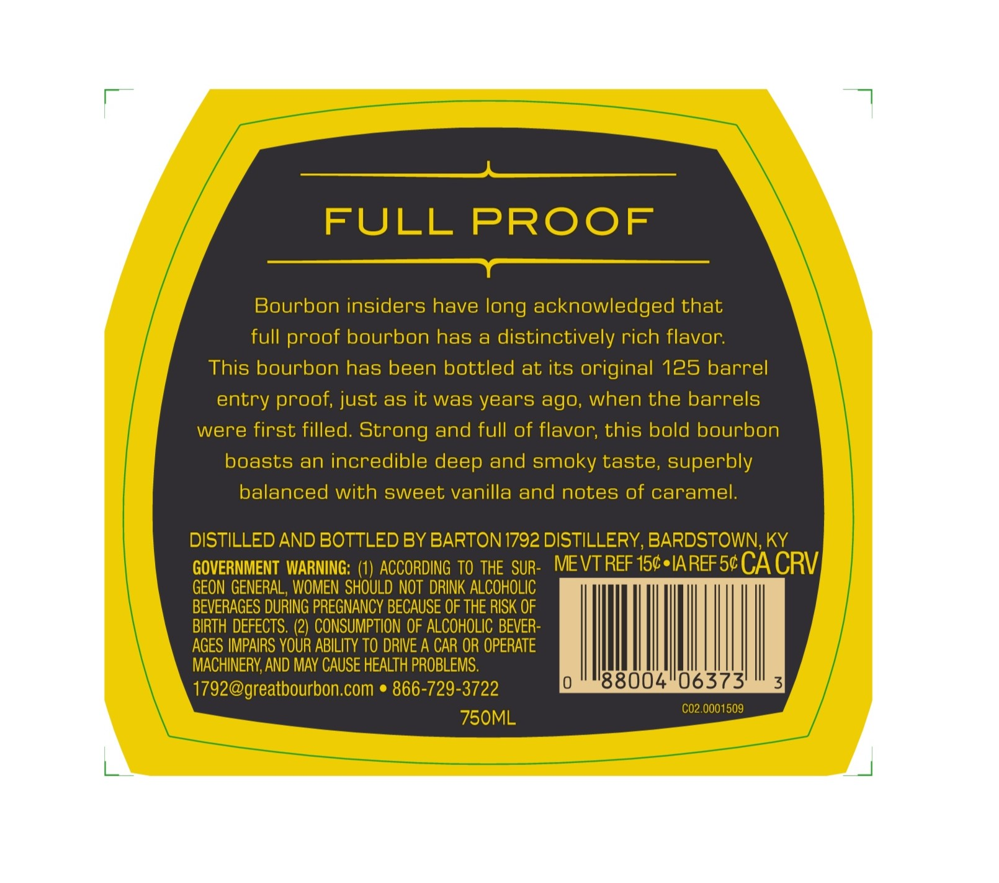

# TTB COLA Label Images - TTBID 24009001000220

**Brand Name:** 1792

**Issue Date:** 01/22/2024

**Origin Code:** 22

**Product Class/Type:** 101

**Source:** [TTB Public COLA Registry](https://ttbonline.gov/colasonline/viewColaDetails.do?action=publicFormDisplay&ttbid=24009001000220)

## Label Images

### Front Label

### Label 2

### Label 3

## Extracted Label Text

*Text extracted via OCR - may contain errors*

*1 image(s) excluded: text did not meet readability threshold*

**Detected Proof:** 125

### Front Label

polenta nas eee ae

FULL PROOF
eeenasisneeecenaiena

aoe

KENTUCKY STRAIGHT BOURBON WHISKEY
62.5% ALC / VOL (125 PROOF)

“ela

### Label 3

=

———————

FULL PROOF

a

Bourbon insiders have long acknowledged that

full proof bourbon has a distinctively rich flavor.

This bourbon has been bottled at its original 125 barrel

entry proof, just as it was years ago, when the barrels

were first filled. Strong and full of flavor, this bold bourbon

boasts an incredible deep and smoky taste, superbly

balanced with sweet vanilla and notes of caramel.

DISTILLED AND BOTTLED BY BARTON 1792 DISTILLERY, BARDSTOWN, KY

GOVERNMENT WARNING: (1) ACCORDING TO THE SUR

. MEVTREF 15¢*IAREF5¢ CA CRV

GEON GENERAL, WOMEN SHOULD NOT DRINK ALCOHOLIC

BEVERAGES DURING PREGNANCY BECAUSE OF THE RISK OF

BIRTH DEFECTS. (2) CONSUMPTION OF ALCOHOLIC BEVER

AGES IMPAIRS YOUR ABILITY TO DRIVE A CAR OR OPERATE

MACHINERY, AND MAY CAUSE HEALTH PROBLEMS.

1792@greatbourbon.com ¢ 866-729-3722

88004'06373

€02.0001509

750ML
