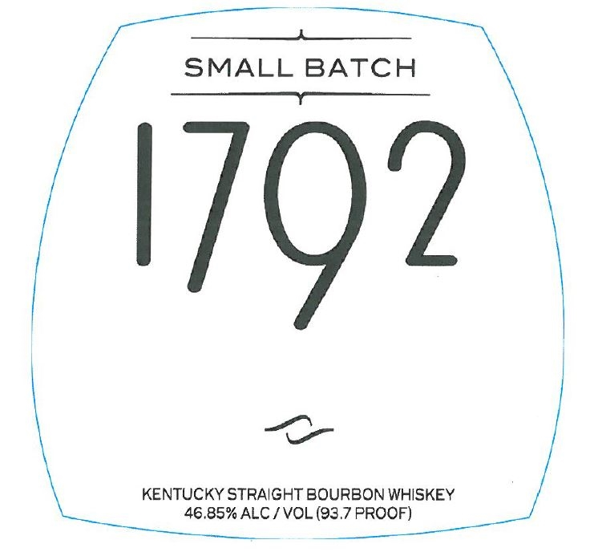
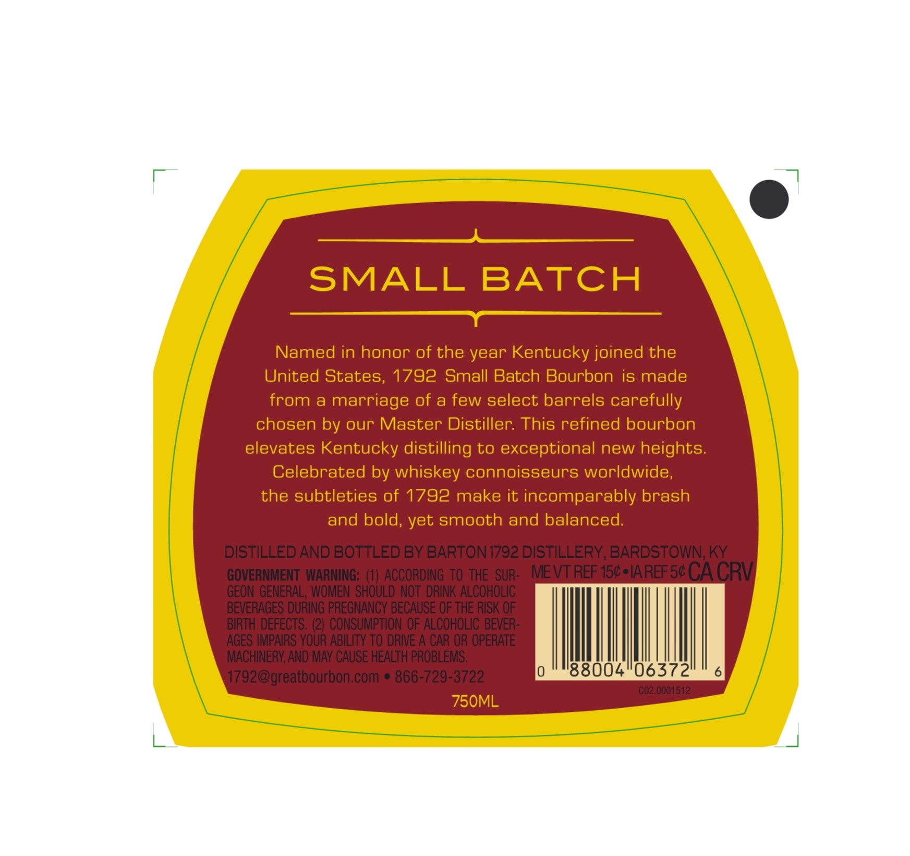

# TTB COLA Label Images - TTBID 24009001000225

**Brand Name:** 1792

**Issue Date:** 01/22/2024

**Origin Code:** 22

**Product Class/Type:** 101

**Source:** [TTB Public COLA Registry](https://ttbonline.gov/colasonline/viewColaDetails.do?action=publicFormDisplay&ttbid=24009001000225)

## Label Images

### Front Label

### Label 2

### Label 3

## Extracted Label Text

*Text extracted via OCR - may contain errors*

*1 image(s) excluded: text did not meet readability threshold*

**Detected Proof:** 93.7

### Front Label

ee

SMALL BATCH
$$$ —_____—.

oa

KENTUCKY STRAIGHT BOURBON WHISKEY
46.85% ALC / VOL (93.7 PROOF)

### Label 3

SMALL BATCH
—————e

Named in honor of the year Kentucky joined the
United States, 1792 Small Batch Bourbon is made
from a marriage of a few select barrels carefully

chosen by our Master Distiller. This refined bourbon

elevates Kentucky distilling to exceptional new heights
Celebrated by whiskey connoisseurs worldwide,
the subtleties of 1792 make it incomparably brash
and bold, yet smooth and balanced.

88004

06372
