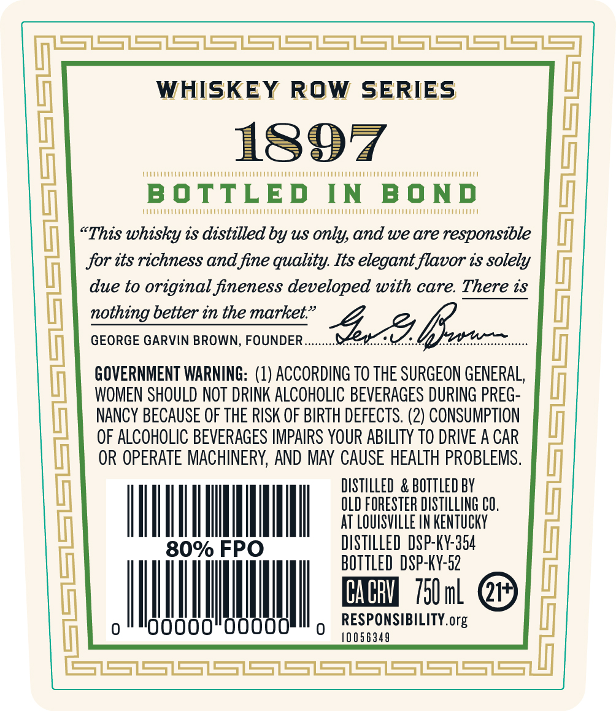
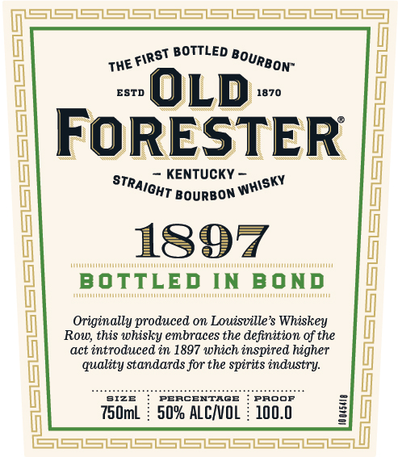
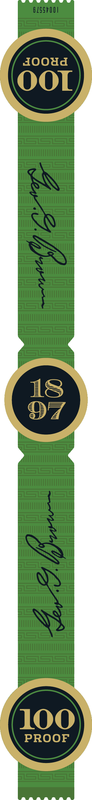

# TTB COLA Label Images - TTBID 24018001000248

**Brand Name:** OLD FORESTER

**Fanciful Name:** 1897 BOTTLED IN BOND

**Issue Date:** 01/19/2024

**Origin Code:** 22

**Product Class/Type:** 101

**Source:** [TTB Public COLA Registry](https://ttbonline.gov/colasonline/viewColaDetails.do?action=publicFormDisplay&ttbid=24018001000248)

## Label Images

### Back Label

### Front Label

### Label 3

## Extracted Label Text

*Text extracted via OCR - may contain errors*

*1 image(s) excluded: text did not meet readability threshold*

**Detected Proof:** 100

### Back Label

S1SSSSSSSSLSS
WHISKEY ROw
SERIES
1897
B O TTLED
IN
B 0 N D
~This whisky is distilled by US only, and we are responsible
for its richness and fine quality: Its elegant flavor is solely
due to original fineness developed with care. There is
nothing better in the market:
2&
GEORGE GARVIN BROWN, FOUNDER_
FOWENSFOULDAROT DRiF ACcORouG BevEREGERGERHGEPFEGL
(
NANCY BECAUSE OF THE RISK OF BIRTH DEFECTS. (2) CONSUMPTION
OF ALCOHOLIC BEVERAGES IMPAIRS YOUR ABILITY TO DRIVE A CAR
OR OPERATE MACHINERY, AND MAY  CAUSE HEALTH PROBLEMS.
DISTILLED  & BOTTLED BY
OLD FORESTER DISTILLING CO,
AT LOUFSVILLE IN KENtuCKY
80% FPO
DiSTILLED DSP-KY-354
BOTTLED DSP-KY-52
CAChV
75UmL
Oooo
RESPONSIBILITY.org
1O 056349
CSSS
Isz

### Front Label

BOTTLED
The
ESTD
OLD
1870
FoRESTER
KENTUCKY
BoURBOn
1897
IMMAAMAMAA
BOTTLED
MMMMAAAMAUMAAAAMAA
IN BOND
[
Originally produced on Louisville $ Whiskey
Row; this whisky embraces the definition of the
act introduced in 1897 which inspired higher
quality standards for the spirits industry:
SIZE
PERCENTAGE
PrOOF
750mL
50% ALCnOL
100.0
FIRST
BourboN"
StraIOHT
Whisky
