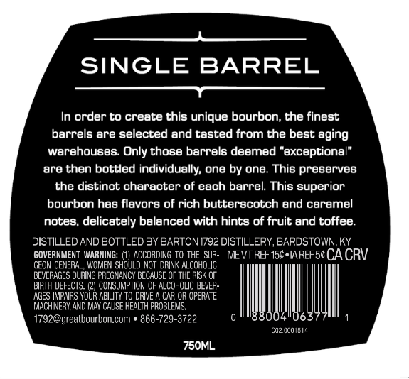
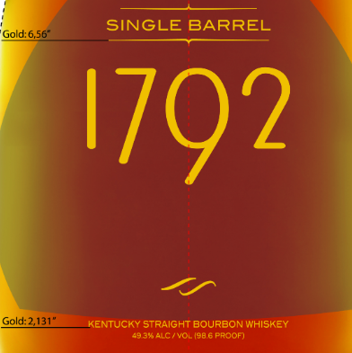

# TTB COLA Label Images - TTBID 24030001000597

**Brand Name:** 1792

**Issue Date:** 01/31/2024

**Origin Code:** 22

**Product Class/Type:** 101

**Source:** [TTB Public COLA Registry](https://ttbonline.gov/colasonline/viewColaDetails.do?action=publicFormDisplay&ttbid=24030001000597)

## Label Images

### Back Label

### Front Label

### Label 3

## Extracted Label Text

*Text extracted via OCR - may contain errors*

*2 image(s) excluded: text did not meet readability threshold*

### Back Label

a

SINGLE BARREL

>

In order to create this unique bourbon, the finest

barrels are selected and tasted from the best aging

werehouses. Only those barrels deemed “exceptional”

are then bottled individually, one by one. This preserves

the distinct character of each barrel. This superior

bourbon has flavors of rich butterscotch and caramel

notes, delicately balanced with hints of fruit and toffee.

DISTILLED AND BOTTLED BY BARTON 1792 DISTILLERY, BARDSTOWN, KY

GGEON GENERAL, WOMEN SHOULD NOT DRINK ALCOHOLIC

GOVERNMENT WARNING: (1) ACCORDING TO THE SUR- MEVTREF 15¢+lAREF 5¢ CA CRV

BEVERAGES DURING PREGNANCY BECAUSE OF THE RISK OF

BIRTH DEFECTS. (2) CONSUMPTION OF ALCOHOUC BEVER-

'

AGES IMPAIRS YOUR ABILITY TO DRIVE A CAR OR OPERATE

"MACHINERY, AND MAY CAUSE HEALTH PROBLEMS,

1792@,greatbourbon.com * 866-729-3722

0 ill 6377 1

ong.

14

750ML.
