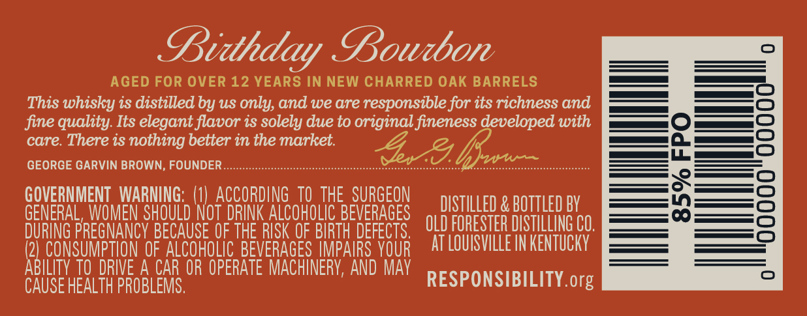
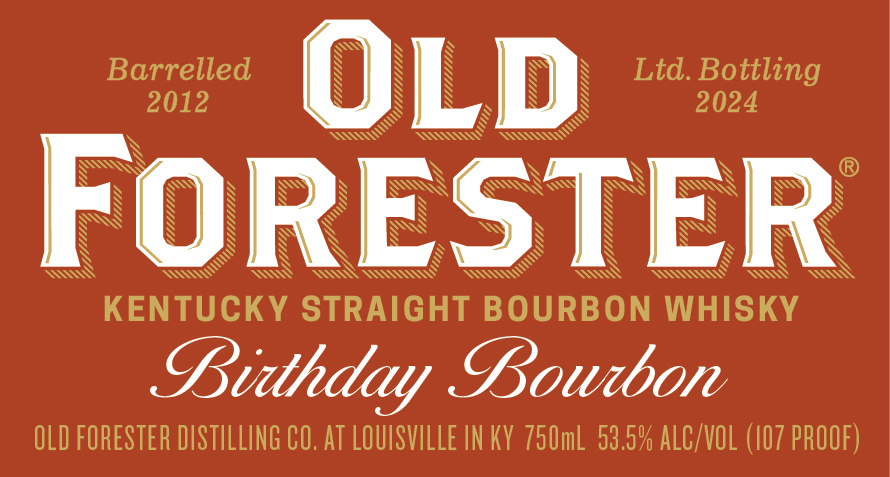
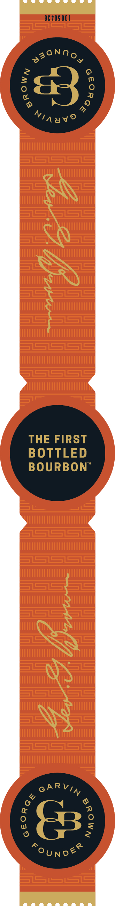

# TTB COLA Label Images - TTBID 24031001000098

**Brand Name:** OLD FORESTER

**Fanciful Name:** BIRTHDAY BOURBON 2024

**Issue Date:** 01/31/2024

**Origin Code:** 22

**Product Class/Type:** 101

**Source:** [TTB Public COLA Registry](https://ttbonline.gov/colasonline/viewColaDetails.do?action=publicFormDisplay&ttbid=24031001000098)

## Label Images

### Back Label

### Front Label

### Label 3

### Label 4

## Extracted Label Text

*Text extracted via OCR - may contain errors*

### Back Label

Di Doubon

AGED FOR OVER 12 YEARS IN NEW CHARRED OAK BARRELS

This whisky is distilled by us only, and we are responsible for its richness and

fine quality. Its elegant flavor is solely due to original fineness developed with

care. There is nothing better in the market.

GEORGE GARVIN BROWN, FOUNDER

GOVERNMENT WARNING: (1) ACCORDING TO THE SURGEON

DISTILLED & BOTTLED BY

GENERAL, WOMEN SHOULD NOT DRINK ALCOHOLIC BEVERAGES

DURING PREGNANCY BECAUSE OF THE RISK OF BIRTH DEFECTS, ULD FORESTER DISTILLING CO.

f

2

ILITY

CONSUMPTION OF ALCOHOLIC BEVERAGES IMPAIRS YOUR AT LOUISVILLE IN KENTUCKY

CAUSE HEALTH PROBLEMS.

RIVE A CAR OR OPERATE MACHINERY, AND MAY

RESPONSIBILITY. org

### Front Label

SS

N

N

S

N

SS

Barrelled

N

N

IS

N

N

Ltd. Bottling

2012

S

S

S

N

2024

ax<< 6S)

Ss

SSO SO

DQ

N

\\

S

N

SS

SS

S

SS

Ss

SS

ISS

SS

S

SS

SN

SS

N

N

N

§

Ss

N

N

N

N

S

Ss

N

N

SSS

SS

\

\

N

Ss

N

SSS

SS

S

SSS

Ss

N

N

S

S

N

S

S

IS

N

SAV

<<

SSS ASC

SSN

<<

WSK

\

SII

SS Test

KENTUCKY STRAIGHT BOURBON WHISKY

LDidheday Bourbon

OLD FORESTER DISTILLING CO. AT LOUISVILLE IN KY 750mL 53,

co/

JA

ALC/VOL (107 PROOF)

### Label 3

96795001

SO

Vinay?

THE FIRST

BOTTLED

BOURBON"

GARY,

“ounv®

### Label 4

hy Bo,

‘~

AGED

eo

l2:

@, YEARS =

“ED now
