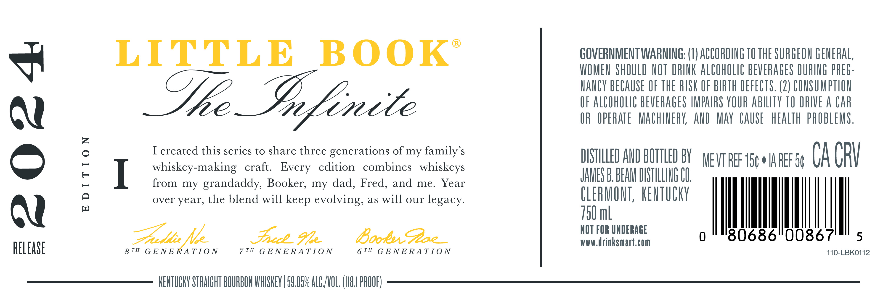
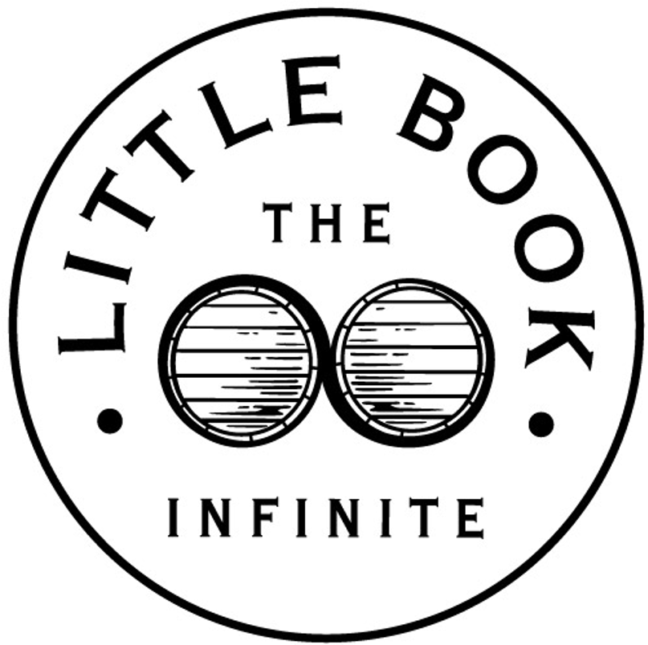

# TTB COLA Label Images - TTBID 24032001000586

**Brand Name:** LITTLE BOOK

**Issue Date:** 02/02/2024

**Origin Code:** 22

**Product Class/Type:** 101

**Source:** [TTB Public COLA Registry](https://ttbonline.gov/colasonline/viewColaDetails.do?action=publicFormDisplay&ttbid=24032001000586)

## Label Images

### Label 1

### Label 2

## Extracted Label Text

*Text extracted via OCR - may contain errors*

### Label 1

GOVERNMENT WARNING: (1) ACCORDING T0 THE SURGEON GENERAL

LITTLE BOOK

WOMEN SHOULD NOT DRINK ALCOHOLIC BEVERAGES DURING PREG

=

NANCY BECAUSE OF THE RISK OF BIRTH DEFECTS. (2) CONSUMPTION

OF ALCOWOLIC BEVERAGES IMPAIRS YOUR ABILITY 10 DRIVE A CAR

Ql

Me Infenele

OR OPERATE MACHINERY, AND MAY CAUSE HEALTH PROBLEMS

I created this series to share three generations of my family’s

whiskey-making craft

Every edition combines whiskeys

SLO NBD AY yea WE CA CRY

=

I

from my grandaddy, Booker, my dad, Fred, and me. Year

JAMES B. BEAM DIS

TILING C1

CLERMONT, KENTUCKY

over year, the blend will keep evolving, as will our legacy

Ql

750 ml

Zeck. Fee

va)

NOT FOR UNDERAGE

an

RELEASE

77H Fcc Fe

67™ GENERATION

www.drinksmart.com

110-LBK0112

KENTUCKY STRAIGHT BOURBON WHISKEY | 58.05% ALC./VOL. (116! PROOF)

### Label 2

RE 8

THE

a Ss

ZN

f-——SN

—=|

E—— |, \Sa,

(=-— } A

e 7

—

S

INFINITE
