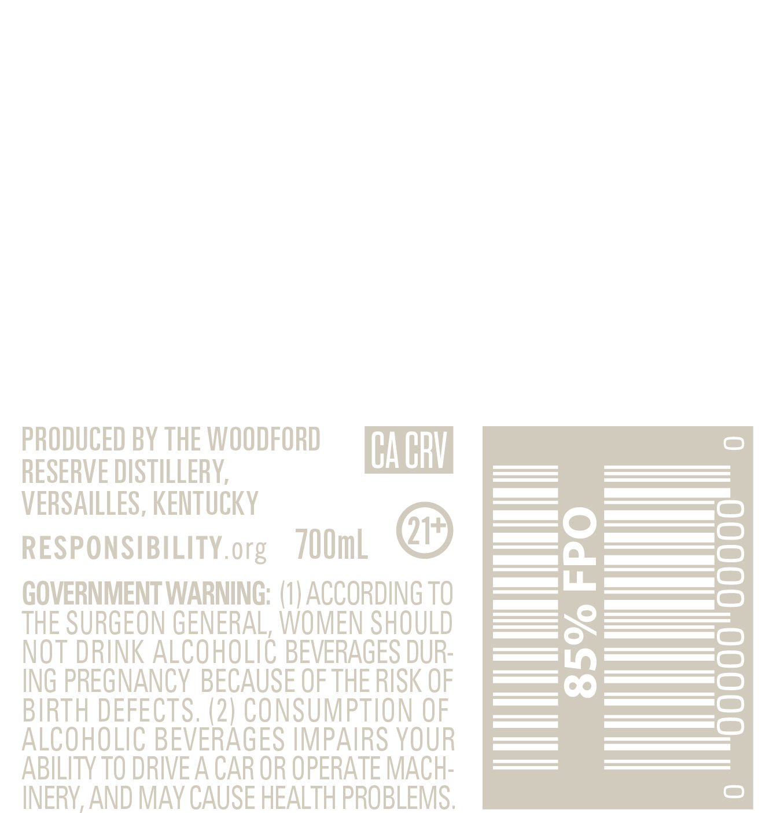
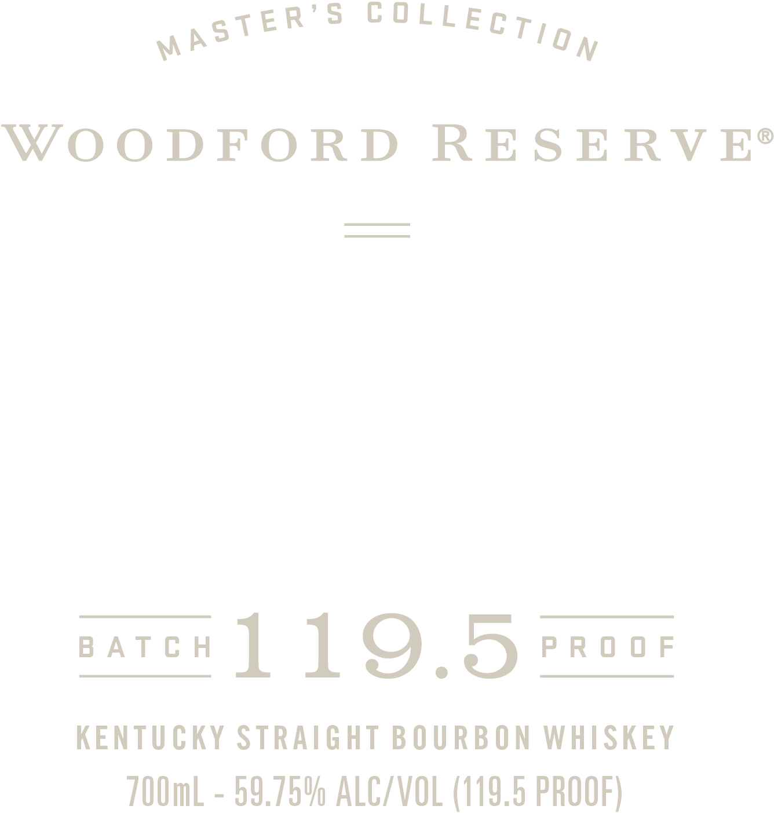

# TTB COLA Label Images - TTBID 24037001000705

**Brand Name:** WOODFORD RESERVE

**Fanciful Name:** MASTER'S COLLECTION BATCH PROOF

**Issue Date:** 02/07/2024

**Origin Code:** 22

**Product Class/Type:** 101

**Source:** [TTB Public COLA Registry](https://ttbonline.gov/colasonline/viewColaDetails.do?action=publicFormDisplay&ttbid=24037001000705)

## Label Images

### Back Label

### Front Label

### Label 3

## Extracted Label Text

*Text extracted via OCR - may contain errors*

### Back Label

PRODUCED BY THE WOODFORD

CACRY

RESERVE DISTILLERY,

VERSAILLES, KENTUCKY

a

RESPONSIBILITY.org 700ml

@

——| «5

—————|=)

es —

LL, es

GOVERNMENT WARNING: (1) ACCORDING TO

_—————— |)

THE SURGEON GENERAL, WOMEN SHOULD

=

NOT DRINK ALCOHOLIC BEVERAGES DUR-

ING PREGNANCY BECAUSE OF THE RISK OF

pel SS)

ALCOHOLIC BEVERAGES IMPAIRS YOUR

BIRTH DEFECTS. (2) CONSUMPTION OF

—

ABILITY TO DRIVE A CAR OR OPERATE MACH-

INERY, AND MAY CAUSE HEALTH PROBLEMS

### Front Label

ane = POTTECT gy

WOODFORD RESERVE®

marek 1 1 Q,5 raves

KENTUCKY STRAIGHT BOURBON WHISKEY
700mL - 59.75% ALC/VOL (119.5 PROOF)

### Label 3

[a iy ANAM ATA WON GFA RHA op anon GS soa a anno TDD
BATCH 8
PROOF 3
