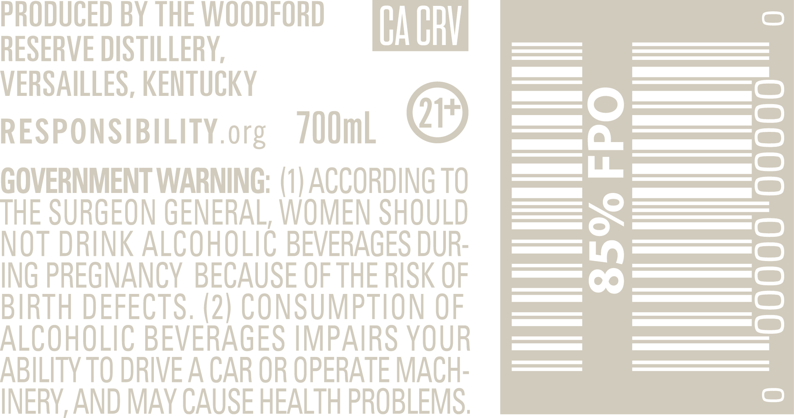

# TTB COLA Label Images - TTBID 24044001000185

**Brand Name:** WOODFORD RESERVE

**Fanciful Name:** MASTER'S COLLECTION MADEIRA CASK FINISH

**Issue Date:** 03/12/2024

**Origin Code:** 22

**Product Class/Type:** 641

**Source:** [TTB Public COLA Registry](https://ttbonline.gov/colasonline/viewColaDetails.do?action=publicFormDisplay&ttbid=24044001000185)

## Label Images

### Back Label

### Front Label

### Label 3

## Extracted Label Text

*Text extracted via OCR - may contain errors*

### Back Label

PRODUCED BY THE WOODFORD

RESERVE DISTILLERY,

CACRY

VERSAILLES, KENTUCKY

es

|=)

RESPONSIBILITY.org /00mL

@®

SS |=)

GOVERNMENT WARNING: (1) ACCORDING T0

THE SURGEON GENERAL, WOMEN SHOULD

NOT DRINK ALCOHOLIC BEVERAGES DUR-

|

ING PREGNANCY BECAUSE OF THE RISK OF

— if)

——_ ©

ALCOHOLIC BEVERAGES IMPAIRS YOUR

BIRTH DEFECTS. (2) CONSUMPTION OF

ABILITY TO DRIVE A CAR OR OPERATE MACH-

INERY, AND MAY CAUSE HEALTH PROBLEMS.

### Front Label

MADEIRA CASK FINISH

(

[O0o6dII

### Label 3

Say:

S NO

20

“Legh
