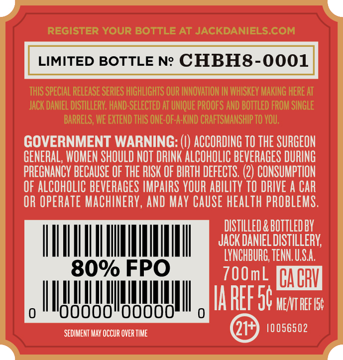
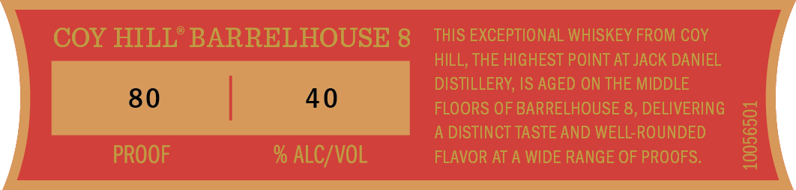
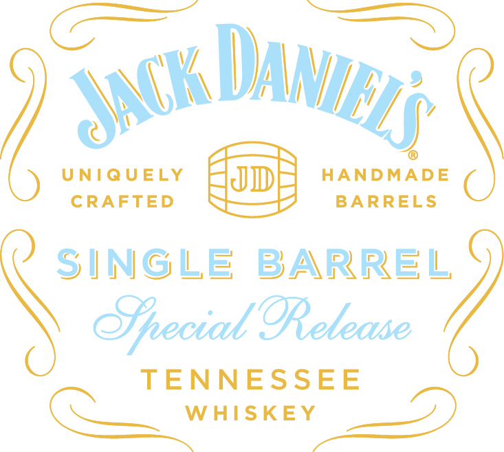
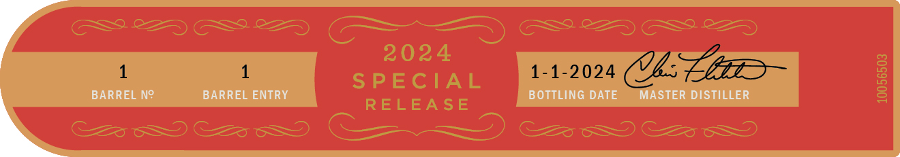

# TTB COLA Label Images - TTBID 24050001000497

**Brand Name:** JACK DANIEL'S

**Fanciful Name:** SINGLE BARREL SPECIAL RELEASE

**Issue Date:** 02/27/2024

**Origin Code:** 43

**Product Class/Type:** 140

**Source:** [TTB Public COLA Registry](https://ttbonline.gov/colasonline/viewColaDetails.do?action=publicFormDisplay&ttbid=24050001000497)

## Label Images

### Back Label

### Front Label

### Label 1

### Label 4

## Extracted Label Text

*Text extracted via OCR - may contain errors*

*1 image(s) excluded: text did not meet readability threshold*

### Back Label

LIMITED BOTTLE Ne CHBH8-0001
UNUM
80% FPO
MUTT
0 *"O0000"00000"" o

### Label 1

Sach Day

UNIQUELY F

yas

Cc] HANDMADE

ay,

\

CRAFTED W&

J = BARRELS

a se ma

CQ waisney =

### Label 4

1 1 1-1-2024 Oh:

BARREL N° BARREL ENTRY BOTTLING DATE MASTER DISTILLER
