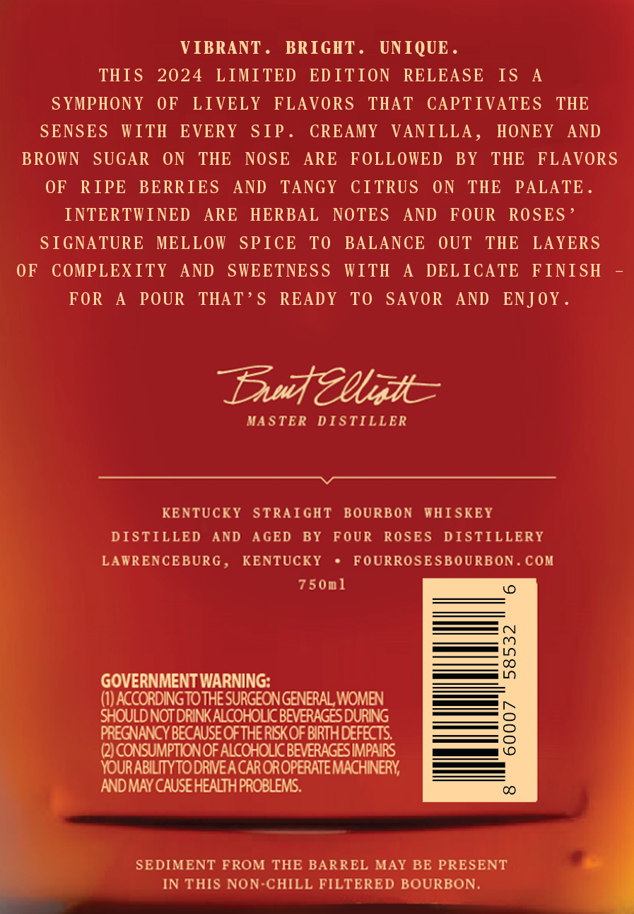
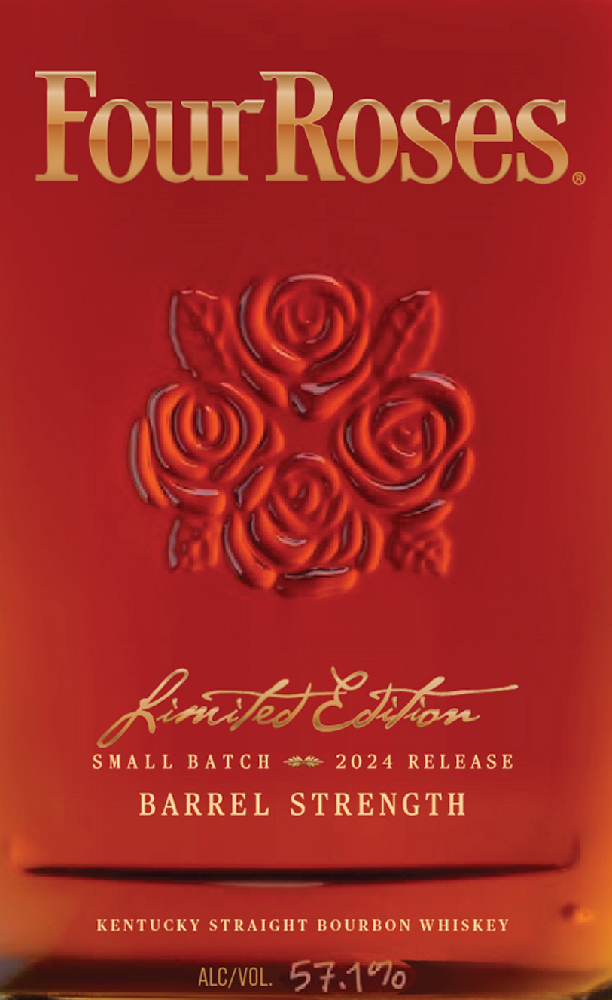
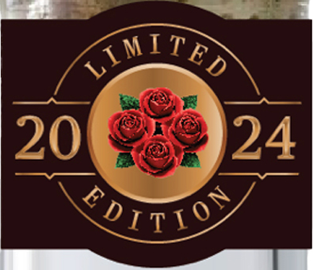

# TTB COLA Label Images - TTBID 24050001000660

**Brand Name:** FOUR ROSES

**Fanciful Name:** LIMITED EDITION SMALL BATCH

**Issue Date:** 02/28/2024

**Origin Code:** 22

**Product Class/Type:** 101

**Source:** [TTB Public COLA Registry](https://ttbonline.gov/colasonline/viewColaDetails.do?action=publicFormDisplay&ttbid=24050001000660)

## Label Images

### Back Label

### Front Label

### Label 3

## Extracted Label Text

*Text extracted via OCR - may contain errors*

*1 image(s) excluded: text did not meet readability threshold*

### Back Label

VIBRANT. BRIGHT. UNIQUE

THIS 2024 LIMITED EDITION RELEASE IS A

SYMPHONY OF LIVELY FLAVORS THAT CAPTIVATES THE

SENSES WITH EVERY SIP

CREAMY VANILLA, HONEY AND

BROWN SUGAR ON THE NOSE ARE FOLLOWED BY THE FLAVORS

OF RIPE BERRIES AND TANGY CITRUS ON THE PALATE

INTERTWINED ARE HERBAL

NOTES AND FOUR ROSES’

SIGNATURE MELLOW SPICE TO BALANCE OUT THE LAYERS

OF COMPLEXITY AND SWEETNESS WITH A DELICATE FINISH

=

FOR A POUR THAT’S READY TO SAVOR AND ENJOY

Daud Migh=

MASTER DISTILLER

KENTUCKY STRAIGHT BOURBON WHISKEY

DISTILLED AND AGED BY FOUR ROSES DISTILLERY

LAWRENCEBURG

KENTUCKY + FOURROSESBOURBON.COM

a

750m1

ica)

— (7)

ee LO

GOVERNMENT WARNING:

(1) ACCORDING TO THE SURGEON GENERAL, WOMEN

—

SHOULD NOT DRINK ALCOHOLIC BEVERAGES DURING

——n (=)

PREGNANCY BECAUSE OF THE RISK OF BIRTH DEFECTS.

(2) CONSUMPTION OF ALCOHOLIC BEVERAGES IMPAIRS

es (0

.

YOURABILITYTO DRIVEA CAR OR OPERATE MACHINERY,

‘AND MAY CAUSE HEALTH PROBLEMS.

SEDIMENT FROM THE BARREL MAY BE PRESENT

IN THIS NON-CHILL FILTERED BOURBON

### Front Label

FourRoses

AX©

iy

(OF

eZ

WS

SMALL BATCH #@ 2024 RELEASE

five Son

BARREL STRENGTH

KENTUCKY STRAIGHT BOURBON WHISKEY
