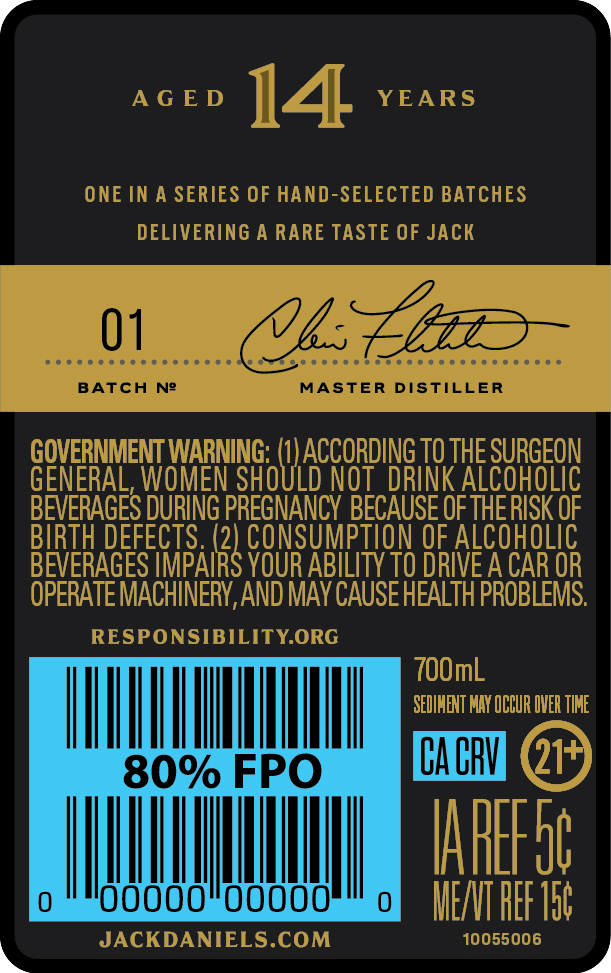
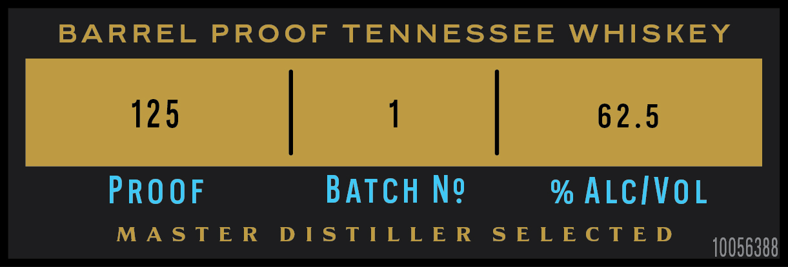

# TTB COLA Label Images - TTBID 24065001000085

**Brand Name:** JACK DANIEL'S

**Fanciful Name:** 14 YEARS OLD

**Issue Date:** 03/12/2024

**Origin Code:** 43

**Product Class/Type:** 140

**Source:** [TTB Public COLA Registry](https://ttbonline.gov/colasonline/viewColaDetails.do?action=publicFormDisplay&ttbid=24065001000085)

## Label Images

### Back Label

### Front Label

## Extracted Label Text

*Text extracted via OCR - may contain errors*

### Back Label

AGED 144 YEARS

ONE IN A SERIES OF HAND-SELECTED BATCHES

DELIVERING A RARE TASTE OF JACK

BATCH N2

UE

MASTER DISTILLER

GENERAL,

GOVERNMENT WARNING: (1

0

5

ACCORDING 10 THE SURGEON

D

KA

|

BEVERAGES DURING a BECAUSE OF TH

BIRTH DEF

PTI

ALCOHOLIC

BEVERAGES IMBAlR

YOUR ABILITY TO DRIVE A CAR OR

OPERATE MACHINERY, AND MAY CAUSE HEALTH PROBLEMS.

RESPONSIBILITY.ORG

100mL

ACAI MAY OCCUR OVER TIME

|

|

|

|

|

|

|

O

NS

|

|

|

00000

00000

0

MEAT REF Tat

»

JACKDANIELS.COM

10055006

4

### Front Label

BARREL PROOF TENNESSEE WHISKEY

VAS TEE DISTILLER SRL EO TRE

10056388
