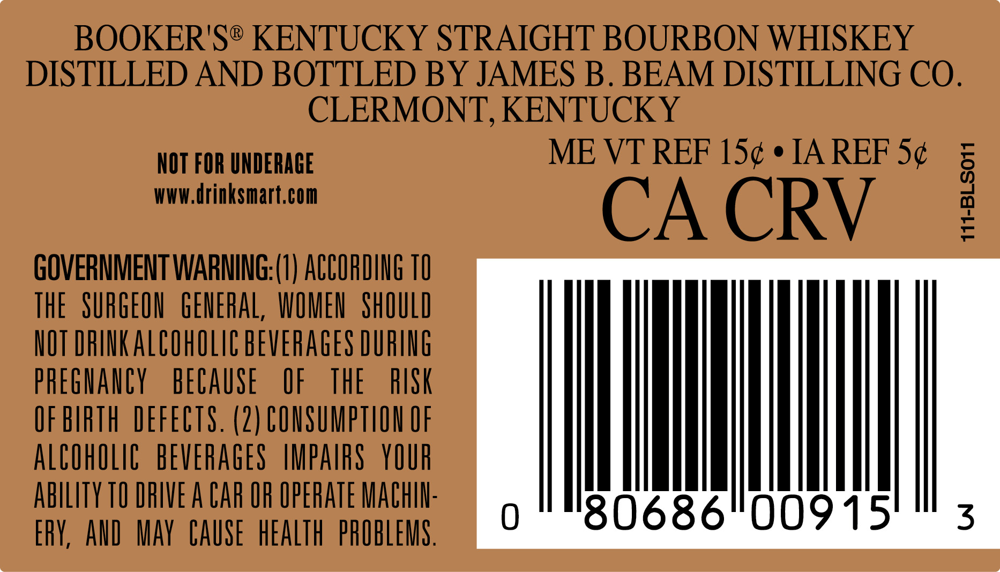

# TTB COLA Label Images - TTBID 24106001000079

**Brand Name:** BOOKER'S

**Issue Date:** 04/24/2024

**Origin Code:** 22

**Product Class/Type:** 101

**Source:** [TTB Public COLA Registry](https://ttbonline.gov/colasonline/viewColaDetails.do?action=publicFormDisplay&ttbid=24106001000079)

## Label Images

### Back Label

### Label 4

## Extracted Label Text

*Text extracted via OCR - may contain errors*

### Back Label

BOOKER'S® KENTUCKY STRAIGHT BOURBON WHISKEY

DISTILLED AND BOTTLED BY JAMES B. BEAM DISTILLING CO.

CLERMONT, KENTUCKY

ME VT REF 15¢ ¢ IA REF 5¢

WWW.drinksmart.com

NOT FOR UNDERAGE

CA CRY

GOVERNMENT WARNING:(1) ACCORDING 10

—t- noche imimimneis

THE SURGEON GENERAL, WOMEN SHOULD

NOT DRINK ALCOHOLIC BEVERAGES DURING

PREGNANCY BECAUSE OF THE RISK

OF BIRTH DEFECTS. (2) CONSUMPTION OF

ALCOHOLIC BEVERAGES IMPAIRS YOUR

ABILITY TO DRIVE A CAR OF OPERATE MACHIN

ERY, AND MAY CAUSE HEALTH PROBLEMS

### Label 4

»—~
