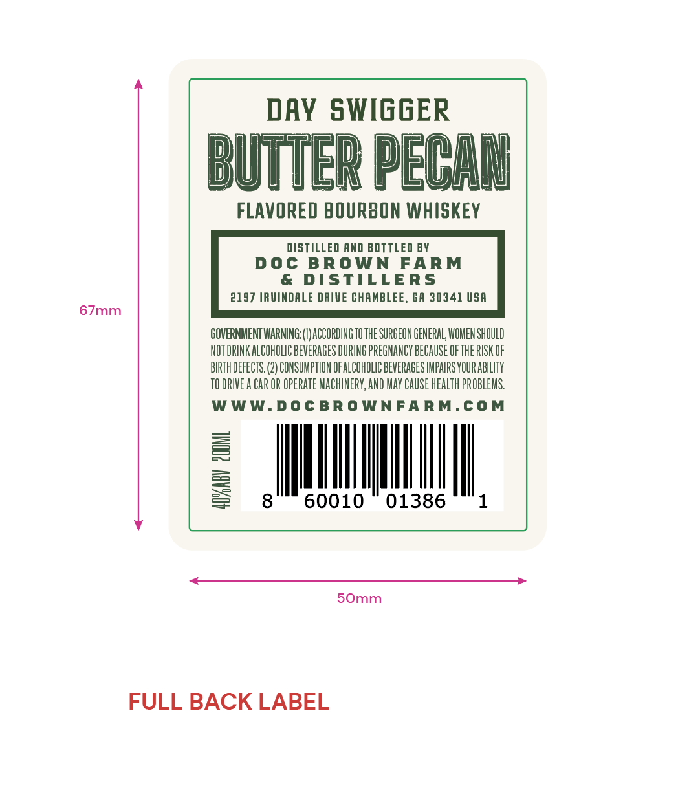
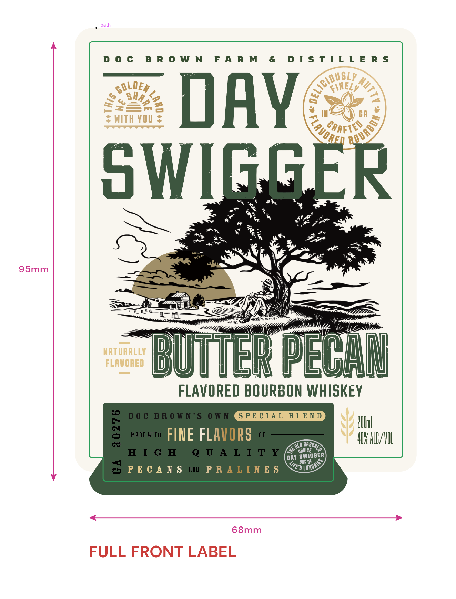

# TTB COLA Label Images - TTBID 24107001000192

**Brand Name:** DAY SWIGGER

**Issue Date:** 05/16/2024

**Origin Code:** 08

**Product Class/Type:** 149

**Source:** [TTB Public COLA Registry](https://ttbonline.gov/colasonline/viewColaDetails.do?action=publicFormDisplay&ttbid=24107001000192)

## Label Images

### Back Label

### Front Label

## Extracted Label Text

*Text extracted via OCR - may contain errors*

### Back Label

DAY SWIGGER

UTTER PECAN

FLAVORED BOURBON WHISKEY

DISTILLED AND BOTTLED BY

DOC BROWN FARM

& DISTILLERS

2197 IRUINDALE DRIVE CHAMBLEE, GA 30341 USA

67mm

GOVERNMENT WARNING: |) ACCORDING 70 THE SURGEON GENERAL WOMEN SHOULD

NOT DRINK ALCOHOLIC BEVERAGES DURING PREGNANCY BECAUSE OF THE RISK OF

BIRTH DEFECTS. (2) CONSUMPTION OF ALCOHOLIC BEVERAGES IMPAIRS YOUR ABILITY

TODRIVEA CAR OR OPERATE MACHINERY, AND MAY CAUSE HEALTH PROBLEMS.

WWW.DOCBROWNFARM.COM

=

60010 01386

50mm

FULL BACK LABEL

### Front Label

path

DOC BROWN FARM & DISTILLERS

——

SLY

ile

S

<\NEL

Dr

LS HZe 2

=nSs

: Sa You >

INA’) cA

DAY

By OAS.

u WIG

ay

x4

*

we >

SS

ay

Ax

i

x

Beg .

95mm

pL

NaN

\7

at

er

Ai)

=

iar —— BEES

pay

=a

CN

NATURALLY

FLAVORED

Wren A PECH

FLAVORED BOURBON WHISKEY

Ooh

IE FL

y

AVAALG/OL

0 BASE

NU

i e,

ANS

68mm

FULL FRONT LABEL
