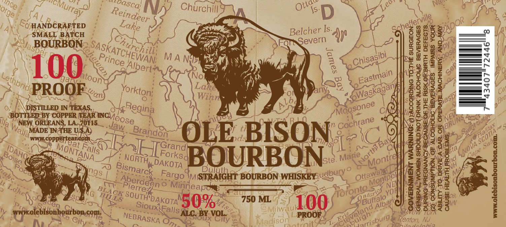
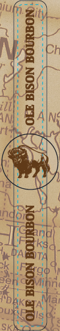

# TTB COLA Label Images - TTBID 24115001000505

**Brand Name:** OLE BISON

**Issue Date:** 04/30/2024

**Origin Code:** 23

**Product Class/Type:** 101

**Source:** [TTB Public COLA Registry](https://ttbonline.gov/colasonline/viewColaDetails.do?action=publicFormDisplay&ttbid=24115001000505)

## Label Images

### Label 1

### Label 2

## Extracted Label Text

*Text extracted via OCR - may contain errors*

*1 image(s) excluded: text did not meet readability threshold*

**Detected Proof:** 100

### Label 1

2"
Nez,
Churchili
Is
D
CQ HANDCRAFTED
Is.
SMALL BATCH
Belcvern
UU
0
Ja BOURBON_
Fon
I
9pv
M A NIe
3
S8
1
PROOF
100
No
2
H
1
DISTILLED NN TEXAS
Winn
M
BOTTLED BY COPPER TEAR
lia
NEW ORLEANS, LA 70115
WADEONpeHeatcom
Brandon
OLE BISON
K
3
Grand
1
6
3
a
ngs
BOURBON_
BOURBON
WHISKEY uaguryo
L
1
3
Og
1
187
|
Fn
750 ML
98598 |
HH
50%
100
8
MN
Milwau
wwnolebisonbogrbon-cons
ALC BY !
VOL;
PROOF
Krenton; NJ
Madison
ance
MeMurray
aoasca;
Ottat
lorge:
Reindeer
Lake
Churchil;
SASKATCHEWAN;
[
8
Chisasibi
Prince
1
Albert:
Eastmain
LLethbride
atoon
%
Lake
Yorkton;
Waskagan
wan)
aSpi
Moosonee
Regina
ONCMoose
BRUNS:
Cochrane
Jaw
Halifax
Walla_
SCOTIA
wwcoppetterate
BBays
Sabl
(NOvA _
Falls
1
MONTANA_
DAHQ
Gape
Forkse
Boise
Teic
Marie
Montrel
NORTH
DAKOTA
Bismarck
Ottawach
Fargo
Montpell
Aberdeen5
Mirneapoi
-Pierrez
Lakel
TToronto '
BLACK
ntaros
YoH
SOUTH DAKOTA
HILLS
Alban
Misa
Sioux Falls:
veland
burgh-
NEBRASKA
Jarrisburg
City
