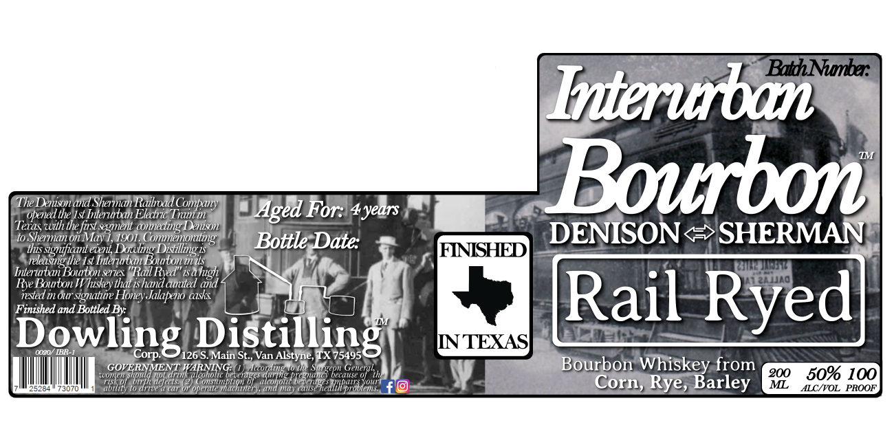
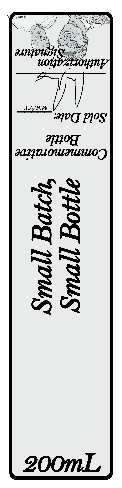

# TTB COLA Label Images - TTBID 24138001000264

**Brand Name:** INTERURBAN BOURBON

**Fanciful Name:** RAIL RYED

**Issue Date:** 05/19/2024

**Origin Code:** 44

**Product Class/Type:** 141

**Source:** [TTB Public COLA Registry](https://ttbonline.gov/colasonline/viewColaDetails.do?action=publicFormDisplay&ttbid=24138001000264)

## Label Images

### Label 1

### Label 2

## Extracted Label Text

*Text extracted via OCR - may contain errors*

*1 image(s) excluded: text did not meet readability threshold*

**Detected Age:** 4 Years

### Label 1

Interuban
The Dknisonand Sherman Raihoad Company
Bourbon
opened the Ist Interitan Electric Tramin
Aged For: 4years
Teras with the fixt segment cnnecing Lemisn
May
1901,Commemorating
Bottle Date:
DENISON
SHERMAN
tus_
sgnficant event Dothng
FINISHED
releasingthe Lst Interwban Bouton_
Interitxi Botonserie "Rail Ryed" isahgh
Rwe Boton
luskey that is hand cated and
rested mour" signahte Honey Jalapeno casks
Rail Ryed]
Finished and Bottled By:
Dowling_
Corp
'126
Distilling
S.Main St , Van Alstyne, TX 75495
NNTEXAS
GOVERMMENT WARNNG:
Acuuing(0
'0 ttenSucye
General
Bourbon Whiskey from
200
50% 100
umth ul
uiti hutuhulil
'pEiona8"
ene
Wecailse 0l
delects
Umdmuium
alcohofi
HealHp
Wlen
Corn,
Barley
ML
2526"
3070
Hn
In Uctt Wl unamd Mtaud
C
GSC
Sdrobieuls
ALC/VOL
PROOF
Sherman_
Diilling !5
Ws
Rye,
Fndn
